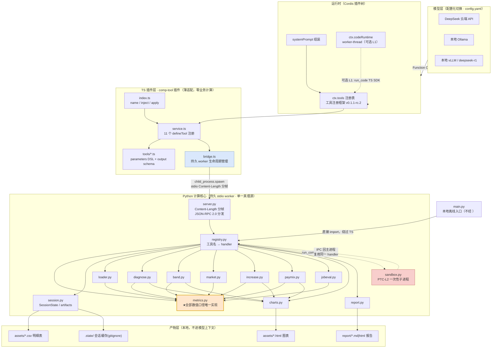
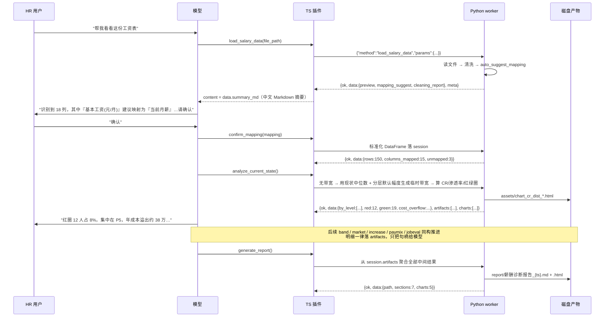
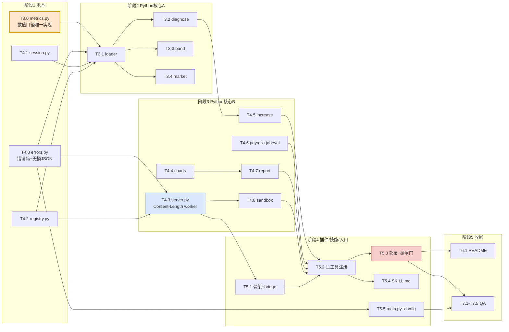

# comp-agent-harness 架构设计文档

> ⚠️ **本文是「早期插件原型」阶段的架构记录（历史资料）**。
> 当前架构已演化为「编排层可插拔」——MCP Server / OpenAI Agents SDK / 本地 CLI 三种接法
> 共用同一套确定性计算内核，**不绑定任何 AI 平台**；**当前架构以仓库根目录
> `README.md` 为准**，本文仅作设计史料保留。
> 文中残留的源码路径与包名引用（如 `dsh-tools/lib/index.js`、`@deepseek-ai/dsh-tools`）
> 是当时契约复核的证据出处，属历史事实，保留以维持可追溯性。

> 版本：v1.0 ｜ 日期：2026-08-30 ｜ 架构师：高见远（software-architect）
> 定位：本文件是**工程师的实现合同**。接口规格精确到字段级，任务分解可直接派工。
> 前置阅读：`BRIEFING.md`、`src/tools/schemas.py`、`mock_data.py`
> 纪律：所有结构性契约均已回读源码复核，凡与 BRIEFING 冲突处以源码为准并显式标注。

---

## 0. 结论摘要（先读这一节）

| 项 | 结论 |
|---|---|
| **BRIEFING 修正 1** | §2.2「推荐优先使用官方 `defineTool()`」**需加限定条件**：官方 `defineTool` 的 `parameters` 走的是**扁平 DSL**，不能直接吃顶层 JSON Schema。详见 §2.2 |
| **BRIEFING 修正 2** | §2.3「PTC 不能依赖 Code Mode」**部分不成立**：`官方 TS 运行时后端` 已由 web bundle 默认注册，官方 Code Mode **现成可用**，只是语言为 TypeScript。缺的只是「报告 `language:'python'` 的运行时后端」。详见 §2.3 |
| **BRIEFING 修正 3** | §4.4 红绿圈双条件判定的**实际生效门槛依赖带宽幅度**，临界值 `s*=0.50`。这是一个会被 HR 追问的细节，已给出精确公式。详见 §6.2 |
| **BRIEFING 修正 4** | §2.2 未提 `output.schema` 的**受支持关键字白名单**（仅 8 个），`minimum/maximum/pattern/minItems` 等会直接抛 `JsonSchemaError`。详见 §2.4 |
| **核心决策 1** | Python 计算核心 + TS 薄适配插件，桥接用**持久 stdio worker + Content-Length 分帧**（不是每次 spawn；v1.0 曾定 NDJSON，T-F 阶段改为 Content-Length，见 §5.2.1） |
| **核心决策 2** | 会话状态放 **Python worker 内存 + artifacts 句柄**，模型上下文只过聚合摘要，明细落盘走句柄 |
| **核心决策 3** | PTC 落地为**第 11 个工具 `run_comp_code`**（Python 子进程沙箱），与官方 `run_code` 契约同构；官方 Code Mode 作为备选路径写入 README |

---

## 1. 总体架构

### 1.1 分层架构图



### 1.2 数据流（一次典型会话）



---

## 2. 契约复核（源码驱动，含 BRIEFING 修正）

复核对象与结论：

| 复核项 | 源文件 | 结论 |
|---|---|---|
| 插件入口三件套 | `dsh-excel-kit/src/index.ts:11-18` | **BRIEFING §2.1 正确**。`name` / `inject=['tools'] as const` / `apply(ctx, config?)`。确实**不导出 `Config`** |
| 工具注册签名 | `dsh-excel-kit/src/service.ts:203-234` | **BRIEFING §2.2 形态正确**，`defineTool({name, description, parameters, output:{schema,render,presentationMeta?}, isConcurrencySafe?, execute})` |
| `defineTool` 官方实现 | `dsh-tools/lib/index.js:836-870` | **修正 1**：官方版会执行 `parameterSchemaSpecToJsonSchema(options.parameters)`，见下 |
| Code Mode 可用性 | `dsh-tools/README.zh.md:16` + `dsh-web-app/cordis.patch.yml:47-49` | **修正 2**，见 §2.3 |
| 输出 schema 子集 | `dsh-tools/lib/index.js:32-41,161-205` | **修正 4**，见 §2.4 |
| 无损 JSON 要求 | `dsh-excel-kit/src/service.ts:138-150` | **新增硬约束**，见 §2.5 |
| Python 运行时后端 | `@deepseek-ai/` 目录列举 | 只有 `官方 Code Mode 运行时` + `官方 TS 运行时后端`，**无 `官方 Python 运行时后端`** — BRIEFING §2.3 这条属实 |
| 依赖可解析性 | `profiles/node_modules/@deepseek-ai/dsh-tools` v0.1.1-rc.2 | **存在且与运行时同版本**，`defineTool` 可 require |

### 2.1 插件入口（沿用金标准，无修正）

```ts
// src/plugins/comp-tool/src/index.ts
import { CompToolService, PluginContext } from './service';

export const name = 'comp-tool 插件';
export const inject = ['tools'] as const;

export function apply(
  ctx: PluginContext,
  config?: { pythonExe?: string; workerScript?: string; projectRoot?: string },
): void {
  new CompToolService(ctx, config).register();
}
```

> ⚠️ 与 `同生态参考插件` 一致：**绝不 `export const Config`**（非 schemastery 对象会使 cordis loader 启动崩溃）。

### 2.2 【修正 1】`defineTool` 的 `parameters` 必须走扁平 DSL

**BRIEFING §2.2 原文**："`工具注册框架` 另有官方 `defineTool()` 辅助函数……推荐优先使用"。
**源码事实**（`dsh-tools/lib/index.js:800-809, 836-845`）：

```js
function parameterSchemaSpecToJsonSchema(spec) {
  const compiled = compilePropertyMap(spec, 'parameters'); // ← 把 spec 的**每个顶层键**当作参数名
  const schema = { type:'object', properties: compiled.properties, ... };
  assertSupportedJsonSchema(schema);
  return schema;
}
function defineTool(options) {
  const parameters = parameterSchemaSpecToJsonSchema(options.parameters); // ← 强制转换
  ...
}
```

⇒ 若把 `{type:'object', properties:{...}, required:[...]}` 传给**官方** `defineTool`，`type` / `properties` / `required` 会被当成三个参数名，**工具入参彻底错乱**。

**裁决**：采用 **方案 A（官方 `defineTool` + 扁平 DSL）**。

| 方案 | 写法 | 优劣 |
|---|---|---|
| **A（采纳）** 官方 `defineTool` + 扁平 DSL | `{ file_path: {type:'string', required:true, description:'...'} }` | ✅ 白送 `validateArgs`→`ToolArgsError(INVALID_ARGS)`，9 个工具的参数校验**零自研**；✅ 支持 `timeoutMs` / `presentCall` / `presentResult`；❌ 依赖 `require('@deepseek-ai/dsh-tools')` 成功 |
| B（金标准原样）本地 identity 适配 + 顶层 JSON Schema | `{type:'object', properties:{...}, required:[...]}` | ✅ excel-kit 已验证可跑；❌ 无参数校验，每个工具得自己写一遍校验 |

已验证 `profiles/node_modules/@deepseek-ai/dsh-tools@0.1.1-rc.2` 存在且与运行时同版本，`defineTool` 可 require（实测 `typeof defineTool === 'function'`）。

> **降级预案（工程师 C 必须实现）**：`service.ts` 顶部做一次探测，`require('@deepseek-ai/dsh-tools')` 失败时回退到**本地 identity `defineTool` + 顶层 JSON Schema**（即方案 B）。**验收点**：` --profile headless "列出你能用的薪酬工具"` 能看到 11 个工具即通过；若启动报 `Cannot read properties of undefined` 或参数校验异常，切方案 B 并重验。

**DSL 速查**（`dsh-tools/README.zh.md:95`）：支持 `string` / `number` / `integer` / `boolean` / `null` / `array` / `object` / `json` / `oneOf`；`required: true` 写在**单个属性上**；显式 `object` 必须声明 `additionalProperties`；`array` 需要 `items`。

### 2.3 【修正 2】PTC 现状与裁决

**BRIEFING §2.3 原文**："本项目的 PTC **不能依赖 Code Mode**"。
**源码事实**：

1. `dsh-web-app/cordis.patch.yml:47-49` 已默认注册 TypeScript 运行时：
   ```yaml
   - insert:
       - id: code-runtime
         name: '@deepseek-ai/dsh-code-runtime-worker-thread'
   ```
2. `dsh-tools/README.zh.md:16` 原文：**「Python 渲染器内置**，驱动任何报告 `language:'python'` 的运行时（第一方 `官方 Python 运行时后端` 后端**另行交付**）」。
   ⇒ 即 **SDK 渲染器（生成代码提示词的那一半）内置且支持 Python**，缺的是**执行代码的运行时后端**。
3. `dsh-tools/lib/index.js` 实际导出 `jsonSchemaToPy` / `renderToolsSdk` / `py-types.js` —— 佐证 Python SDK 渲染器确实内置。
4. `mode ?? "native"`（`lib/index.js`）⇒ 默认 `native`，Code Mode 需显式开启。
5. Node v22.22.2 的 `module.stripTypeScriptTypes` 存在（实测）⇒ worker-thread 的类型剥离链路可用。

⇒ **精确结论**：**官方 Code Mode 完全可用，但程序语言只能是 TypeScript**（因为只有 TS 运行时后端）。BRIEFING「不能依赖 Code Mode」的说法过强；准确表述是「不能用 Code Mode 跑 Python」。

**裁决：双路径，默认走自建 L2。**

| 路径 | 机制 | 语言 | 采纳 |
|---|---|---|---|
| **PTC-L1** | 官方 Code Mode：`settings.yaml` 加 `tools: { mode: both }`，模型调官方 `run_code`，SDK 自动绑定 11 个工具 | TypeScript | 备选，写入 README 作为「另一条集成路径」 |
| **PTC-L2（默认）** | 自建第 11 个工具 `run_comp_code` | **Python** | **采纳** |

**选 L2 为默认的三条理由**：

1. **口径一致性（决定性）**：本项目的核心卖点是「模型绝不心算，全部由 pandas 确定性执行」。L1 让模型写 TypeScript 编排，虽然数值仍由 Python 算，但模型在 TS 里做筛选/聚合时极易夹带自研算术，破坏这条纪律。L2 让模型写 Python，可以直接 `import pandas as pd` 操作真实 DataFrame，计算**仍然只发生在受控沙箱内**，口径与 9 个工具完全一致。
2. **避免双轨混淆**：`mode: both` 下模型同时看到 `run_code`(TS) 与 `run_comp_code`(Python)，会犹豫甚至写错语言，实测风险高。默认 `native` 只有一条路径。
3. **演示焦点**：面试讲解要一句话说清「模型写代码 → 沙箱执行 → 只回摘要」。单一路径更利落。

**契约同构要求（工程师 B 必须遵守）**：`run_comp_code` 的入参/出参**刻意与官方 `run_code` 对齐**，以便 README 里可以这样表述——

> 本项目自建的 `run_comp_code` 与 官方 Code Mode 的 `run_code` 传输契约同构（`{code, description}` → `{logs, result}`，同样「只有 print/return 的内容进入模型上下文」，同样每次运行全新状态）。差异仅在于执行语言为 Python、以及执行环境为一次性子进程而非 worker thread。官方 `官方 Python 运行时后端` 后端交付后，可在不动插件层的前提下替换执行后端。

### 2.4 【修正 4】`output.schema` 的受支持关键字白名单

源码（`dsh-tools/lib/index.js:32-41`）：

```
CONSTRAINT_KEYWORDS = { type, oneOf, properties, required, additionalProperties, items, enum, const }
ANNOTATION_KEYWORDS = { description, title, default, examples }
```

`checkSchemaNode`（`lib/index.js:204`）对任何其它键直接报错：
`` `${path}.${key} is not a supported keyword (subset: type/oneOf/properties/required/additionalProperties/items/enum/const + annotations)` ``

⇒ **`minimum` / `maximum` / `pattern` / `minItems` / `minLength` / `format` / `$ref` / `anyOf` / `allOf` 一律禁止**，`oneOf` 旁边不许出现 `properties`/`items` 等兄弟约束键。

**裁决（见 §4）**：11 个工具统一注册**同一个泛型 envelope schema**（`data` 声明为 `{}` 开放节点），每个工具 `data` 的精确结构写在 **description（模型可见）+ 本文件 §4（工程师可读）+ Python 侧运行时自检** 三处。
理由：避免 10 份深层 schema 触碰白名单；`data` 形态本来就随数据完整度变化（有/无市场数据、有/无带宽），泛型更诚实。

### 2.5 【新增硬约束】返回给宿主的必须是「无损 JSON」

`dsh-excel-kit/src/service.ts:138-150` 的 `toLossless()` 是踩过坑的防御层，揭示了两条宿主强制要求：

1. **`undefined` 属性会被丢弃** → round-trip 后结构变化，宿主校验失败。
2. **`NaN` / `±Infinity` 会被 `JSON.stringify` 变成 `null`** → round-trip 不等，宿主判定 `invalid output`。

⇒ **Python 侧纪律（写进 `errors.py` 与每个 handler 的出口）**：

```python
def to_lossless(obj):
    """出口统一规整：NaN/Inf → None，None 保留，numpy 标量 → 原生标量。
    依据： 注册表在呈现前校验『无损 JSON』，NaN 会被 JSON.stringify 静默变 null
    导致 round-trip 不等而被判 invalid output（见 dsh-excel-kit/src/service.ts:138）。"""
```

pandas 处处是 NaN，**这是本项目最容易翻车的一处**，QA 必须单列一条验收项。

### 2.6 其余已确认契约（无修正）

| 契约 | 要点 | 来源 |
|---|---|---|
| `execute` 返回 | `{ content: ContentBlock[], structuredContent: unknown }`；`output.render` 把规范值转成 `content` | `service.ts:52-62` |
| **模型看到的是 `content`** | 循环保留的是「参数 + 注册表的最终内容」；`structuredContent` 给程序消费（Code Mode 绑定） | `dsh-tools/README.zh.md:182` |
| `isConcurrencySafe` | 只有**恰好返回 `true`** 才并发；其它一律独占 | `README.zh.md:103` |
| 并发安全约定 | 「选择并发的主体不得改变父级拥有的状态；共享状态竞态必须具有交换性，否则必须安全拒绝」 | `README.zh.md:103` |
| `timeoutMs` | **仅声明，注册表绝不强制执行**，需自建 | `README.zh.md:101,197` |
| `spillStore` | 未在 `inject` 声明的服务**必须**用 `ctx.get('spillStore')` 取，直接读属性会抛 | `service.ts:167-171` |
| 插件注册方式 | bundle 落位 `profiles/node_modules/<pkgname>/`，`package.json` 含 `"":{"bundle":{"patch":"./cordis.patch.yml"}}`，用 `- insert:` 注册；再追加到 `profiles/web/package.json` 的 `` | `` skill |
| 硬闸门 | `--dump-config` 通过 **≠** 真能启动；必须真跑 `--profile headless` | `` skill |
| 编码坑 | 无 BOM 的 UTF-8；PowerShell `Set-Content -Encoding utf8` 带 BOM 会致 启动崩溃 | 同上 |

---

## 3. 目录结构与文件清单

```
comp-agent-harness/
├── config.yaml ★新 模型提供方 / 路径 / 安全开关 / 业务默认值
├── main.py ★新 本地离线入口（不经 ，QA 与面试演示主力）
├── mock_data.py 【已存在·勿动】造数脚本
├── README.md ★新 T6
├── data/ 【已存在】sample_salary.csv / messy_salary.csv / sample_salary.xlsx
├── report/ 【已存在】报告产物
├── assets/ 【已存在】图表 HTML / PNG、明细 CSV
├── .state/ 【已存在】会话缓存（.gitignore，永不进仓库）
├── docs/
│ └── ARCHITECTURE.md 【本文件】
└── src/
    ├── tools/ # ============ Python 计算核心 ============
    │ ├── schemas.py 【已存在·勿动】18 标准字段 + 别名词典 + 业务参数字典（单一真理源）
    │ ├── metrics.py ★新 【A】全部数值口径的唯一实现（见 §6）
    │ ├── errors.py ★新 【B】统一错误码 / ToolError / to_lossless
    │ ├── session.py ★新 【B】SessionState / artifacts 句柄 / 持久化
    │ ├── registry.py ★新 【B】工具名 → handler 映射（server 与 sandbox 共用）
    │ ├── loader.py ★新 【A】读文件 / 清洗 / 映射 / 标准化
    │ ├── diagnose.py ★新 【A】CR / 渗透率 / 红绿圈 / 分布统计
    │ ├── band.py ★新 【A】带宽生成 + 相邻职级重叠度
    │ ├── market.py ★新 【A】市场对标
    │ ├── increase.py ★新 【B】调薪模拟（含预算守恒求解）
    │ ├── paymix.py ★新 【B】固浮比模拟
    │ ├── jobeval.py ★新 【B】海氏 / 美世打分与职级建议
    │ ├── charts.py ★新 【B】plotly 图表（中文字体 + kaleido 降级）
    │ ├── report.py ★新 【B】Markdown + HTML 报告生成
    │ ├── sandbox.py ★新 【B】PTC-L2 沙箱（AST 预检 + 受限命名空间 + 子进程隔离）
    │ └── server.py ★新 【B】stdio Content-Length 分帧 + JSON-RPC 2.0 分发
    ├── plugins/comp-tool/ # ============ TS Cordis 插件 ============
    │ ├── package.json ★新 【C】含 
    │ ├── tsconfig.json ★新 【C】
    │ ├── cordis.patch.yml ★新 【C】无 BOM；只用 - insert:
    │ └── src/
    │ ├── index.ts 【已存在目录】name / inject / apply
    │ ├── service.ts ★新 【C】11 个工具的 defineTool 注册 + 降级探测
    │ ├── bridge.ts ★新 【C】持久 worker 生命周期（启动/心跳/超时/重启）
    │ ├── envelope.ts ★新 【C】泛型 output.schema + render + presentationMeta
    │ └── schemas.ts ★新 【C】10 份 parameters DSL
    └── skills/comp-analyst/
        └── SKILL.md ★新 【C】首席薪酬官助手（CCO Copilot）
```

### 关键文件职责

| 文件 | 职责 | 为什么单独存在 |
|---|---|---|
| **`metrics.py`** | CR、渗透率、带宽幅度、中位值级差、**相邻职级重叠度**、预算守恒、固浮比、市场差距 —— **全部数值口径的唯一实现** | **最重要的架构约束**：口径漂移是薪酬系统的头号事故。若 `diagnose.py` 与 `band.py` 各写一份 CR，两边迟早不一致且无人能发现。集中后 QA 只需审计 1 个文件，README 的方法论章节也只需对齐 1 处 |
| **`errors.py`** | 错误码枚举、`ToolError`、`to_lossless()`、handler 装饰器（统一 try-except → 错误 envelope） | 11 个工具的异常处理与无损 JSON 规整必须完全一致，否则某一处漏掉 NaN 就是一次宿主校验失败 |
| **`session.py`** | `SessionState{ session_id, df_raw, mapping, df_std, cleaning_report, artifacts{}, charts[], history[] }`；artifacts 句柄；`.state/` 持久化 | 工具间传递中间结果的**唯一合法通道**（见 §5.3） |
| **`registry.py`** | `TOOL_HANDLERS: Dict[str, Callable[[dict, SessionState], dict]]` | `server.py`（正常路径）与 `sandbox.py`（PTC 绑定）共用同一份 handler，保证 PTC 里调 `tools.market_benchmark()` 与模型直接调该工具**走完全相同的代码**（口径一致性） |
| **`python-bridge.ts`** | spawn 持久 Python 进程；Content-Length 分帧解码；请求 id 配对；超时 kill；崩溃自动重启 | Windows 下 `spawn` 与 stdio 编码是重灾区，隔离在一个文件里便于排查。分帧解码器为纯函数式 `FrameDecoder`，可脱离 Python 单测 |
| **`charts.py`** | plotly 出 HTML（内联 plotlyjs）+ kaleido 可选 PNG；**统一中文字体设置** | plotly 默认无中文字体，中文全变方框 —— 必须单点统一设置，不能每个图表各写一次 |

---

## 4. 工具接口规格（11 个 · 工程师实现合同）

### 4.0 统一信封（所有工具共用）

**返回 envelope（成功与失败同构）**：

```jsonc
{
  "ok": true, // boolean
  "code": "OK", // string，见 §4.10 错误码表
  "message": "中文一句话结论",
  "data": { }, // 每工具不同，见 §4.1-4.10；必含 "summary_md"
  "artifacts": [ // 明细产物（落盘，不进上下文）
    { "id": "increase_detail", "kind": "table", "path": "assets/increase_detail_20260830_120000.csv",
      "rows": 150, "preview": [ /* 前 5 行 */ ] }
  ],
  "charts": [
    { "id": "cr_before_after", "kind": "html", "path": "assets/chart_cr_before_after_20260830_120000.html" }
  ],
  "warnings": ["市场 P25 有 12 行缺失，已按职级中位数插补"],
  "meta": { "session_id": "default", "rows": 150, "levels": 9, "elapsed_ms": 128 }
}
```

失败时 `ok:false`，`data` 为 `{}`，并额外带 `hint`（给模型的下一步建议）与 `detail`（技术细节）：

```jsonc
{ "ok": false, "code": "NO_SESSION", "message": "尚未加载数据，请先调用 load_salary_data。",
  "hint": "调用 load_salary_data(file_path='...') 后再重试。", "data": {}, "artifacts": [], "charts": [], "warnings": [], "meta": {"session_id":"default"} }
```

**`data.summary_md` 是模型真正读到的内容**（`render` 直接透传为 `content`）。要求：
- 中文 Markdown，**含关键表格**（Markdown 表格比长段落省 token 且模型解析更稳）；
- **绝不罗列原始明细行**（150 行薪资明细进上下文 = 既贵又泄敏）；
- 结尾必须有「下一步建议」（引导模型调下一个工具）。

**注册的 `output.schema`（泛型，11 个工具共用）**：

> ⚠️ **2026-08-30 实测更正（原提案有两处会被 工具注册框架 拒绝，以本节为准）**
>
> 实测对象：`@deepseek-ai/dsh-tools@0.1.1-rc.2` 的官方 `defineTool`。
> 复现与反例见 `src/plugins/comp-tool/src/__tests__/definetool-probe.mjs`（16 项全过）。
>
> | 项 | 原提案 | 实测结论 |
> |---|---|---|
> | 顶层 `required: ['ok','code','message']` | 支持 | ❌ 抛 `schema.required is not supported by the value schema DSL`。**根因**：`output.schema` 走 `valueSchemaSpecToJsonSchema()`，与 `parameters` 走的 `parameterSchemaSpecToJsonSchema()` 是**两个不同的编译器**，前者不支持顶层 `required` |
> | 开放节点写裸 `{}` | 支持 | ❌ 抛 `schema.properties.data.type must be string/.../json`。开放节点必须写 `{ type: 'json' }`（编译后才变成 `{}`） |
>
> 另：`additionalProperties` 必须显式 `true`/`false`，缺失即报错；
> 且必须是**布尔**，传 schema 对象会报
> `parameters.X.additionalProperties must be explicitly true or false`。

```ts
export const ENVELOPE_OUTPUT_SCHEMA = {
  type: 'object',
  properties: {
    ok: { type: 'boolean' },
    code: { type: 'string' },
    message: { type: 'string' },
    hint: { type: 'string' },
    detail: { type: 'string' },
    data: { type: 'json' }, // 开放节点：必须是 type:'json'
    artifacts: { type: 'array', items: { type: 'json' } },
    charts: { type: 'array', items: { type: 'json' } },
    warnings: { type: 'array', items: { type: 'string' } },
    meta: { type: 'json' },
  },
  // ★ 不得加顶层 required —— value schema DSL 不支持（见上表）
  additionalProperties: false,
} as const;
```

`render`：`(_args, value) => [{ type:'text', text: (value as Envelope).data?.summary_md ?? (value as Envelope).message }]`
`presentationMeta`：`(_args, value) => ({ title: TOOL_TITLES[value?.code ? ... : ''] ?? `comp: ${name}` })` —— 简化为按 `ok` 与工具名拼标题。

**关键工程决策：错误不用 `throw`，而是返回 `ok:false` 的 envelope。**
理由：`dsh-tools/README.zh.md:182` 说明抛异常会被转成 `Error: <message>` 纯文本，模型只能看到一句话、拿不到结构化 `code`；而 `throw` 还会让返回值不匹配 `output.schema`，触发宿主校验失败。统一 envelope 让模型可以**按 `code` 自主纠错**（如 `NO_SESSION` → 自动先 `load_salary_data`）。

### 4.1 `load_salary_data`

读文件 → 清洗 → 字段映射建议 → 落 session。**不改任何薪资数值**。

```jsonc
{
  "name": "load_salary_data",
  "description": "读取薪酬表（csv/xlsx），自动清洗脏数据并给出字段映射建议。必须在其他分析工具之前调用。只返回前 5 行预览与统计摘要，绝不返回全量明细。",
  "parameters": { // 扁平 DSL
    "file_path": { "type": "string", "required": true, "description": "csv/xlsx 绝对路径，使用 C:/... 正斜杠" },
    "sheet": { "type": "string", "description": "xlsx 的 sheet 名，缺省第一个" },
    "session_id": { "type": "string", "description": "会话标识，缺省 'default'" },
    "desensitize": { "type": "boolean","description": "是否对姓名做脱敏、薪资做比例缩放，缺省 true" }
  }
}
```

`data` 契约：

```jsonc
{
  "summary_md": "…",
  "file": { "path":"…", "format":"csv", "rows_raw":151, "cols_raw":21, "sheet":null },
  "preview": [ { "工号":"E0001", "基本工资(元/月)": 14200, … } ], // ≤5 行，原始列名
  "columns": [ { "raw":"基本工资(元/月)", "suggest":"monthly_salary", "label":"当前月薪", "confidence":100, "ambiguous":false, "candidates":[{"field":"monthly_salary","label":"当前月薪","score":100}] } ],
  "mapping_status": {
    "required_satisfied": false, // 必填字段是否已全部有建议
    "missing_required": ["band_mid"], // 无建议的必填字段
    "unmapped_columns": ["入职日期","备注","数据状态"],
    "conflicts": [ { "raw":"min", "candidates":["band_min","mkt_p25"] } ]
  },
  "cleaning_report": {
    "duplicate_rows": 1, "dropped_rows": 1,
    "non_numeric": [ { "row":3, "column":"基本工资(元/月)", "value":"待定", "action":"置为空" } ],
    "missing_required": [ { "row":11, "column":"基本工资(元/月)", "action":"剔除该行" } ],
    "normalized": [ { "row":5, "column":"上年度绩效", "from":"a+", "to":"A" } ],
    "rows_final": 149
  },
  "next_action": "confirm_mapping"
}
```

### 4.2 `confirm_mapping`

固化映射 → 生成标准 DataFrame（`CANONICAL_ORDER` 列序）。

```jsonc
{
  "name": "confirm_mapping",
  "description": "确认或修正字段映射，把原始表标准化为内部标准字段（18 个）。映射固化后全部下游工具才可用。",
  "parameters": {
    // ★ additionalProperties 必须是**布尔 true**，不能写成 { "type":"string" }。
    // 这是本节最容易踩的一处：JSON Schema 里写 schema 是合法的，但 工具注册框架
    // 的 value-schema DSL 会抛
    // `parameters.mapping.additionalProperties must be explicitly true or false`。
    // tools/gen_plugin_schemas.py 会自动把 schema 形态规整成 true（共修过 7 处），
    // 但手改 schemas.ts 时务必照此写。
    "mapping": { "type":"object", "required": true, "additionalProperties": true,
                    "description": "原始列名 → 标准字段名的字典；值设为 '' 表示忽略该列" },
    "session_id": { "type":"string" },
    "fill_missing_band": { "type":"boolean", "description": "带宽三列缺失时是否立即用现状中位数+分层默认幅度生成临时带宽，缺省 true" },
    "fill_annual_cash": { "type":"boolean", "description": "年度总现金缺失时是否用 月薪×12 推算，缺省 true" }
  }
}
```

`data`：

```jsonc
{
  "summary_md": "…",
  "rows": 149,
  "columns_mapped": 15,
  "columns_ignored": 3,
  "standard_fields_present": ["emp_id","level","monthly_salary","band_min","band_mid","band_max","mkt_p25","mkt_p50","mkt_p75", …],
  "standard_fields_absent": ["job_score","pay_mix"],
  "auto_filled": { "band_mid":"由职级现状中位数生成", "annual_total_cash":"月薪×12 推算" },
  "level_stats": [ { "level":"P1","count":20,"median":8000 } ],
  "next_action": "analyze_current_state"
}
```

### 4.2b `desensitize_data`

> T-F 阶段由 team-lead 追加（第 11 个工具）。对应 BRIEFING §4.2：「提供 `desensitize()`：对真实数据做比例缩放/泛化（薪资乘随机系数、隐藏姓名）」。

对**已加载到 session 的数据**做脱敏，产出一份可安全外发的副本。**不改动 session 内的原数据**（保持分析结果可追溯），只写新文件。

```jsonc
{
  "name": "desensitize_data",
  "description": "对当前会话数据生成脱敏副本：姓名泛化、薪资按比例缩放、ID 重编号。原 session 数据不变，只写出新文件。用于需要把数据交给第三方或用于演示时。",
  "parameters": {
    "session_id": { "type":"string" },
    "output_path": { "type":"string", "required": true, "description": "脱敏结果输出路径（csv/xlsx）" },
    "name_mode": { "type":"string", "enum":["surname","drop","pseudonym"], "description": "surname=只留姓+**（默认）；drop=整列删除；pseudonym=替换为 E0001 式编号" },
    "salary_mode": { "type":"string", "enum":["scale","rank","drop"], "description": "scale=整体乘一个随机系数（默认，保持分布形态与相对关系）；rank=替换为职级中位值（最保守）；drop=删除薪资列" },
    "scale_range": { "type":"array", "items": { "type":"number" }, "description": "salary_mode=scale 时的系数区间，默认 [0.85, 1.15]" },
    "drop_columns": { "type":"array", "items": { "type":"string" }, "description": "额外强制删除的标准字段，如 ['name','dept']" },
    "seed": { "type":"number", "description": "随机种子，缺省随机（不写死保证不可反推）" }
  }
}
```

`data`：

```jsonc
{
  "summary_md": "…",
  "output": { "path":"data/desensitized_20260830.csv", "rows":149, "cols":16, "bytes":21480 },
  "transformations": [
    { "field":"name", "mode":"surname", "sample":"张**" },
    { "field":"monthly_salary", "mode":"scale", "factor":1.0732,
      "note":"整体乘以同一系数，保留分布形态与个体间相对关系；系数为随机生成且默认不固定种子" },
    { "field":"emp_id", "mode":"renumber", "prefix":"E" }
  ],
  "reversibility_warning": "比例缩放脱敏不可逆推原始值，但**保留了全部统计特征与个体相对排序**，仍属敏感数据，外发前请确认接收方资格。",
  "session_unchanged": true,
  "next_action": "analyze_current_state"
}
```

> **口径说明（HR 视角）**：`scale` 模式保留分布形态，适合做**方法演示/培训**；`rank` 模式把个人薪资替换为职级中位值，抹掉个体差异，适合**对外分享薪酬架构**。两种模式的适用场景不同，工具在 `summary_md` 里必须提示。

### 4.3 `analyze_current_state`

```jsonc
{
  "name": "analyze_current_state",
  "parameters": {
    "session_id": { "type":"string" },
    "group_by": { "type":"array", "items": { "type":"string", "enum":["level","dept","job_family","perf_grade"] },
                      "description": "分组维度，缺省 ['level']" },
    "band_source": { "type":"string", "enum":["auto","existing","market"], "description": "auto=缺失时按现状中位数生成；existing=仅用表中带宽；market=用市场 P50 作中位值。缺省 auto" },
    "red_cr": { "type":"number", "description": "红圈 CR 阈值，缺省 1.20" },
    "green_cr": { "type":"number", "description": "绿圈 CR 阈值，缺省 0.80" },
    "make_charts": { "type":"boolean", "description": "缺省 true" }
  }
}
```

`data`：

```jsonc
{
  "summary_md": "…",
  "basis": { "band_source":"auto", "band_generated": true,
             "note":"表中无带宽三列，已用各职级现状月薪中位数作为临时中位值，并按层级默认带宽幅度生成带宽" },
  "effective_thresholds": { // ★见 §6.2，HR 会追问这里
    "spread_used": 0.35,
    "red_cr_effective": 1.1489, // = min(1.20, (1+s)/(1+s/2))
    "green_cr_effective": 0.8511, // = max(0.80, 1/(1+s/2))
    "binding_rule": "越界条件更严格（带宽幅度 35% < 临界值 50%）"
  },
  "overall": { "headcount":149, "monthly_total":2418000, "annual_total":29016000,
               "cr_mean":1.02, "cr_median":1.00, "penetration_median":0.52 },
  "by_level": [ { "level":"P5","count":18,"min":22000,"p25":24300,"median":26400,"p75":28900,"max":35600,"mean":27100,
                  "band_min":21500,"band_mid":26500,"band_max":29025,
                  "cr_median":1.00,"red":4,"green":2,"ok":12,"annual_cost":5710000 } ],
  "circles": {
    "red": { "count":12, "pct":8.05, "annual_overflow_yuan": 384200, "top_levels":[{"level":"P5","count":4}] },
    "green": { "count":19, "pct":12.75, "annual_gap_yuan": 521300, "top_levels":[{"level":"P3","count":6}] },
    "ok": { "count":118, "pct":79.19 }
  },
  "risks": [
    { "type":"cost", "severity":"high", "text":"P5 职级红圈 4 人，年成本溢出约 38.4 万元，且多为司龄>6 年员工" },
    { "type":"attrition", "severity":"high", "text":"P3 职级绿圈 6 人，低于带宽下限，离职风险集中在此" }
  ],
  "next_action": "generate_band"
}
```

`charts`：`cr_distribution`（CR 分布直方图 + 红绿圈着色）、`level_box`（各职级薪资箱线图叠加带宽区间）。

### 4.4 `generate_band`

```jsonc
{
  "name": "generate_band",
  "parameters": {
    "session_id": { "type":"string" },
    "mode": { "type":"string", "enum":["new","optimize"], "required": true,
                        "description": "new=全新设计（用基准中位值/级差推导）；optimize=基于现状优化（用现状中位数回归）" },
    "base_mid": { "type":"number", "description": "最低职级的基准中位值月薪；缺省取现状最低职级中位数" },
    "midpoint_diff": { "type":"number", "description": "相邻职级中位值级差，如 0.15；缺省 0.15。支持传数组按职级分别指定" },
    "spread_mode": { "type":"string", "enum":["tier_default","uniform","explicit"], "description": "缺省 tier_default（按 schemas.LEVEL_TIER_RULES 分层）" },
    "spread": { "type":"number", "description": "spread_mode=uniform 时统一带宽幅度" },
    "spread_by_level":{ "type":"object", "additionalProperties": { "type":"number" }, "description": "spread_mode=explicit 时按职级指定" },
    "use_market": { "type":"boolean", "description": "有市场数据时，中位值是否锚定市场分位值，缺省 true" },
    "market_percentile": { "type":"string", "enum":["P25","P50","P75"] },
    "levels": { "type":"array", "items": { "type":"string" }, "description": "职级序列；缺省从数据推断并按 level_sort_key 排序" },
    "make_charts": { "type":"boolean" }
  }
}
```

`data`：

```jsonc
{
  "summary_md": "…",
  "formula_note": "下限 = 中位值 / (1 + 带宽幅度/2)；上限 = 下限 × (1 + 带宽幅度)。该式隐含『带宽关于中位值对称』假设；带宽幅度采用相对下限口径 (上限-下限)/下限。",
  "spread_definition": "relative_to_min",
  "band_table": [ { "level":"P1","mid":8000,"min":6957,"max":8695,"spread":0.25,"spread_mid":0.2222,
                    "headcount":20,"median":8000,"cr_median":1.00,
                    "overlap_with_next": { "next_level":"P2","overlap_amount":0,"overlap_pct_lower":0.0,
                                           "overlap_pct_avg":0.0,"status":"gap" } } ],
  "overlap_summary": {
    "formula": "重叠度 = (低职级上限 − 高职级下限) / (低职级上限 − 低职级下限)",
    "denominator_basis": "lower_range_width",
    "mean_overlap_pct": 57.1,
    "min_overlap_pct": 40.0, "max_overlap_pct": 60.5,
    "gaps": [ { "between":"M2→M3", "gap_amount": 1200 } ],
    "diagnosis": "平均重叠度 57%，高于 30%-50% 的经验区间，晋升带来的薪酬激励偏弱；建议把中位值级差由 15% 提至 21%（≈0.6×带宽幅度 35%）"
  },
  "cost_impact": { "current_annual": 29016000, "cost_to_band_min": 386000, "cost_to_mid": 1240000 },
  "next_action": "market_benchmark"
}
```

`artifacts`：`band_table`（CSV，9 行 × 带宽 + 重叠度全部字段）。
`charts`：`band_overlap`（横向条形图，按职级画带宽区间，重叠部分着色 —— 用 `plotly.graph_objects` 的 `shape` 或多 trace 叠加实现）。

### 4.5 `market_benchmark`

```jsonc
{
  "name": "market_benchmark",
  "parameters": {
    "session_id": { "type":"string" },
    "strategy": { "type":"string", "enum":["auto","P25","P50","P75"], "description": "auto=按 schemas.DEFAULT_MARKET_STRATEGY 按岗位序列取（销售/技术 P75、管理/职能 P50、操作 P25）" },
    "strategy_by_family": { "type":"object", "additionalProperties": { "type":"string" } },
    "group_by": { "type":"array", "items": { "type":"string", "enum":["level","job_family","dept"] } },
    "make_charts": { "type":"boolean" }
  }
}
```

`data`：

```jsonc
{
  "summary_md": "…",
  "strategy_used": { "销售":"P75", "技术":"P75", "管理":"P50", "操作":"P25", "职能":"P50" },
  "overall": { "market_index": 0.971, "gap_pct_mean": -2.9, "levels_covered": 9, "levels_missing_data": 0 },
  "by_level": [ { "level":"P5","headcount":18,"company_median":26400,
                  "mkt_p25":21800,"mkt_p50":27200,"mkt_p75":33100,
                  "target_percentile":"P75","target_value":33100,
                  "gap_to_target_pct": -20.2, "annual_cost_to_target": 1447000 } ],
  "by_family": [ { "job_family":"技术","headcount":58,"gap_pct_mean":-8.4,"annual_cost_to_target":1680000 } ],
  "total_cost_to_target": { "annual": 5230000, "pct_of_payroll": 18.0 },
  "next_action": "simulate_increase"
}
```

### 4.6 `simulate_increase`

```jsonc
{
  "name": "simulate_increase",
  "parameters": {
    "session_id": { "type":"string" },
    "budget_pct": { "type":"number", "required": true, "description": "调薪总预算占调薪前年度薪资总额的比例，如 0.06 = 6%" },
    "strategies": { "type":"array", "items": { "type":"string", "enum":["A","B","C","D"] },
                         "description": "A=平均分配 B=优先补绿圈 C=按绩效加权 D=优先保留红圈(冻结)；缺省 ['A','B','C','D']" },
    "custom_weights": { "type":"object", "additionalProperties": { "type":"number" },
                         "description": "自定义绩效权重，如 {'A':2.0,'B':1.2,'C':0.4,'D':0}；缺省取 schemas.PERF_WEIGHTS" },
    "cap_pct": { "type":"number", "description": "个人单次涨幅上限，如 0.20；缺省 0.20" },
    "green_target": { "type":"number", "description": "策略 B 的补底目标：'band_min' 或 0.85 表示补到 CR=0.85；缺省 'band_min'" },
    "frozen_for_red": { "type":"boolean", "description": "策略 D 下红圈是否完全冻结且不占调薪池，缺省 true" },
    "make_charts": { "type":"boolean" }
  }
}
```

`data`：

```jsonc
{
  "summary_md": "…",
  "budget": { "annual_payroll_before": 29016000, "budget_pct": 0.06, "budget_amount": 1740960,
              "conservation_check": { "max_abs_error": 0.0, "passed": true } },
  "strategies": [
    { "key":"A", "name":"平均分配",
      "total_cost": 1740960, "budget_used_pct": 100.0,
      "avg_increase_pct": 6.0, "median_increase_pct": 6.0,
      "red_before":12, "red_after":12, "green_before":19, "green_after":16,
      "cr_before": {"mean":1.02,"median":1.00,"std":0.13},
      "cr_after": {"mean":1.08,"median":1.06,"std":0.13},
      "by_level": [ {"level":"P1","headcount":20,"avg_increase_pct":6.0,"cost":132000} ],
      "pros":"操作简单、内部公平感强", "cons":"与绩效、与市场脱钩，保留不了关键人才" },
    { "key":"B", "name":"优先补绿圈", "…": "…" },
    { "key":"C", "name":"按绩效加权", "…": "…" },
    { "key":"D", "name":"优先保留红圈", "…": "…" }
  ],
  "recommendation": { "strategy":"C", "reason":"在 6% 预算下，策略 C 使红圈由 12 降至 9、绿圈由 19 降至 7，且高绩效（A/B）调薪幅度达 8.4%/5.6%，激励导向最强；策略 B 虽最快消除绿圈但会把预算消耗在低绩效群体。" },
  "next_action": "simulate_pay_mix"
}
```

`artifacts`：`increase_detail_策略{A,B,C,D}`（4 份 CSV，150 行 × [emp_id, level, dept, perf_grade, 原月薪, 新月薪, 涨幅%, 原CR, 新CR, 原圈层, 新圈层]）。
`charts`：`cr_before_after`（调薪前后 CR 分布对比，按策略分面）、`strategy_cost`（各策略成本柱状图 + 预算线）。

### 4.7 `simulate_pay_mix`

```jsonc
{
  "name": "simulate_pay_mix",
  "parameters": {
    "session_id": { "type":"string" },
    "target_mix": { "type":"object", "additionalProperties": { "type":"string" },
                      "description": "岗位序列 → 目标固浮比 '固定:浮动'，如 {'销售':'40:60'}；缺省取 schemas.JOB_FAMILY_PAY_MIX" },
    "mix_source": { "type":"string", "enum":["family_default","existing","explicit"], "description": "缺省 family_default" },
    "achievement_range": { "type":"array", "items": { "type":"number" }, "description": "业绩达成率扫描区间 [min,max,step]，缺省 [0,1.5,0.1]" },
    "make_charts": { "type":"boolean" }
  }
}
```

`data`：

```jsonc
{
  "summary_md": "…",
  "formula_note": "固定部分 = 年度总现金 × 固定占比；浮动目标 = 年度总现金 × 浮动占比；实际总收入 = 固定部分 + 浮动目标 × 达成率",
  "by_family": [ { "job_family":"销售","headcount":32,"current_mix":"62:38","target_mix":"40:60",
                   "annual_total_cash":8420000, "fixed_part":3368000, "variable_target":5052000,
                   "income_at_0":3368000, "income_at_100":8420000, "income_at_150":10938000,
                   "downside_risk_pct": -60.0, "upside_pct": 30.0 } ],
  "curves": [ { "job_family":"销售", "points":[ {"achievement":0.0,"income_ratio":0.40}, {"achievement":1.0,"income_ratio":1.00}, {"achievement":1.5,"income_ratio":1.30} ] } ],
  "precondition_warning": "⚠️ 高浮动比例的前提条件是：业绩可量化、可归因到个人、结算周期短；长周期协作型业务强行高浮动会破坏协作。",
  "next_action": "generate_report"
}
```

`charts`：`paymix_curves`（各序列收入-达成率曲线，x=0~150%，y=收入实现率，含 100% 基准线）。

### 4.8 `calc_job_score`

```jsonc
{
  "name": "calc_job_score",
  "parameters": {
    "session_id": { "type":"string" },
    "model": { "type":"string", "enum":["hay","mercer"], "required": true, "description": "hay=海氏三要素 mercer=美世IPE四因素" },
    "position": { "type":"string", "description": "岗位名称；用于输出标题与批量时的键" },
    "scores": { "type":"object", "required": true, "additionalProperties": { "type":"number" },
                    "description": "子维度 → 1-10 分。hay 的子维度见 schemas.JOB_EVAL_MODELS['hay'].subfactors；mercer 同理。可只传部分，缺失维度按同要素已填均值或 5 分兜底并记 warning" },
    "batch_file": { "type":"string", "description": "批量打分表路径（csv/xlsx），与 scores 二选一" },
    "template_out": { "type":"string", "description": "若指定，则导出空白打分模板到该路径" }
  }
}
```

`data`：

```jsonc
{
  "summary_md": "…",
  "model": "hay", "model_label": "海氏三要素法",
  "position": "高级Java工程师",
  "factors": [ { "factor":"知识技能","weight":0.40,"subfactor_mean":4.33,"weighted":1.732 }, … ],
  "raw_score": 4.06, // 1-10 加权原始分
  "job_score": 650, // = round(raw_score × 160)，量级对齐 JOB_SCORE_LEVEL_BANDS
  "scale_note": "job_score = round(raw_score × 160)，使 1-10 分加权结果映射至 160-1600 量级，与 schemas.JOB_SCORE_LEVEL_BANDS 对齐。本项目为简易打分表，非正式认证评估。",
  "suggested_level": "P4",
  "level_band": { "lo":560, "hi":700, "level":"P4" },
  "batch_result": null,
  "next_action": "generate_report"
}
```

### 4.9 `generate_report`

```jsonc
{
  "name": "generate_report",
  "parameters": {
    "session_id": { "type":"string" },
    "sections": { "type":"array", "items": { "type":"integer", "enum":[1,2,3,4,5,6,7] }, "description": "缺省全部 7 节" },
    "formats": { "type":"array", "items": { "type":"string", "enum":["md","html"] }, "description": "缺省 ['md','html']" },
    "title": { "type":"string" },
    "include_appendix": { "type":"boolean", "description": "是否附方法论与口径说明，缺省 true" }
  }
}
```

`data`：

```jsonc
{
  "summary_md": "…",
  "outputs": [ { "format":"md", "path":"report/薪酬诊断报告_20260830_120000.md", "bytes": 42130 },
               { "format":"html", "path":"report/薪酬诊断报告_20260830_120000.html", "bytes": 3184220 } ],
  "sections": [ {"no":1,"title":"执行摘要","chars":980}, … ],
  "charts_embedded": 5,
  "chart_mode": "html_inline", // html_inline | png | link_only
  "data_source_declaration": "本报告全部数据来自本地模拟数据（data/ 目录），未上传任何云端服务。"
}
```

### 4.10 `run_comp_code`（PTC-L2）

与官方 `run_code` 契约同构（§2.3）。

```jsonc
{
  "name": "run_comp_code",
  "description": "在受限 Python 沙箱中执行一段分析代码，用于批量编排薪酬工具、或直接用 pandas 做自定义分析。可用：pandas as pd、numpy as np、math、statistics、json；已注入 tools 对象（9 个薪酬工具的同步封装）与 comp 会话对象。禁止：文件读写、网络、子进程、导入白名单外模块、访问 __class__/__globals__ 等双下划线属性。每次运行全新环境，只有 print() 与顶层 return 的内容会返回。超时 15 秒。",
  "parameters": {
    "code": { "type":"string", "required": true, "description": "Python 代码（同步，不支持 async）" },
    "description": { "type":"string", "required": true, "description": "一句话说明这段代码做什么" },
    "session_id": { "type":"string" }
  }
}
```

`data`：

```jsonc
{
  "summary_md": "…",
  "logs": ["P5 红圈 4 人，平均 CR 1.31", "…"],
  "result": { "levels": ["P5","P6"], "total_overflow": 384200 },
  "truncated": false,
  "elapsed_ms": 2310,
  "sandbox": { "python": "C:/ProgramData/anaconda3/python.exe", "timeout_s": 15, "exit_code": 0, "isolated": "subprocess" }
}
```

沙箱规格详见 §5.4。

### 4.11 错误码表

| code | 含义 | 模型应如何处理 |
|---|---|---|
| `OK` | 成功 | — |
| `FILE_NOT_FOUND` | 文件不存在 | 向用户确认路径（注意 Windows 需 `C:/...`） |
| `UNSUPPORTED_FORMAT` | 非 csv/xlsx | 让用户另存 |
| `MISSING_REQUIRED_FIELD` | 必填标准字段无映射 | 回问用户该列对应哪一列 |
| `NO_SESSION` | session 未加载数据 | 先调 `load_salary_data` |
| `SESSION_EXPIRED` | worker 重启导致内存态丢失 | 重新 `load_salary_data` + `confirm_mapping` |
| `MAPPING_NOT_CONFIRMED` | 未固化映射 | 先调 `confirm_mapping` |
| `INVALID_PARAMS` | 入参不合法 | 按 `hint` 修正后重试 |
| `COLUMN_NOT_FOUND` | 指定分组列不存在 | 换成 `level`/`dept` 等 |
| `NO_MARKET_DATA` | 表中无市场分位列 | 跳过对标或用带宽分析替代 |
| `NO_BAND_DATA` | 无带宽且未允许自动生成 | 先调 `generate_band` |
| `BUDGET_INFEASIBLE` | 预算不足以满足约束（如全部补到下限） | 降低 `budget_pct` 或放宽 `green_target` |
| `CHART_FAILED` | 绘图失败（已降级不影响数据） | 忽略，继续出报告 |
| `SANDBOX_VIOLATION` | 代码含禁止语法/模块 | 改写代码（禁 import / 禁文件 IO） |
| `SANDBOX_TIMEOUT` | 超时 15s | 缩小数据范围或分批处理 |
| `INTERNAL_ERROR` | 未预期异常 | 记录 `detail`，向用户致歉并给出替代路径 |

---

## 5. 关键设计决策与理由

### 5.1 Python 计算核心 vs 全部用 TS

**决策：Python 计算核心，TS 只做契约适配（薄），TS 侧零业务计算。**

| 方案 | 理由 |
|---|---|
| ✅ **Python 核心** | ① 需求硬性指定 pandas/numpy/openpyxl/plotly；② 分位数插值、groupby 语义与 HR 习惯一致，数值可复现；③ 作品集要展示「Python 负责确定性计算、模型负责理解」的分工，这条对比必须真实存在才有说服力；④ 本地部署场景下 Python 生态的离线能力更成熟 |
| ❌ 全 TS | ① 要重造 pandas 的分位数/分组/缺失值语义，口径与 HR 的 Excel/Python 口径对不上，是**正确性风险**而非效率问题；② 与需求「数据：pandas、numpy、openpyxl、plotly」直接冲突；③ 失去「模型不心算、由确定式代码执行」的叙事支点 |
| ❌ Python 只做脚本、TS 编排 | 会让业务逻辑散落在两侧，口径漂移风险回到 5.1 要解决的问题 |

**边界纪律**：TS 侧只允许做四件事 —— 参数透传、调用 worker、把 `data.summary_md` 变成 `content`、错误兜底。**任何数字运算出现在 `.ts` 文件中视为架构违规**（CR 评审项）。

### 5.2 桥接：持久 stdio worker vs 每次 spawn

**决策：持久 worker（长驻子进程）+ Content-Length 分帧。**

> **⚠️ 本节已于 T-F 阶段修订**：v1.0 原定 **NDJSON**，现改为 **Content-Length**（LSP/MCP 同款）。
> 原理由「Content-Length 多一层解析易错」是在优化**实现者便利**，而非**运行时健壮性**。
> 对一个持有会话 DataFrame 的长驻 worker 而言，健壮性必须优先 —— 理由见 §5.2.1。

| 方案 | 冷启动 | 会话状态 | 复杂度 | 结论 |
|---|---|---|---|---|
| ✅ **持久 stdio worker** | 首次 ~2-3s（anaconda `import pandas`），后续 ~10-30ms | **天然持有 DataFrame**，跨工具传递零序列化 | 需处理心跳/超时/崩溃重启 | **采纳** |
| ❌ 每次 spawn 进程 | 每次 2-3s × 10+ 次调用 = 一次会话 30s+ 纯等待，交互体验不可用 | 每次都要重新读文件、重新映射，或靠磁盘 pickle 反复序列化 | 低 | 否决 |
| ❌ HTTP 本地服务 | 同持久方案 | 同 | 多出端口占用、防火墙、跨进程鉴权问题；本地软件不该开端口 | 否决 |
| ❌ Python MCP server + `` | 同持久方案 | 同 | **代码量最少**（官方支持 stdio MCP） | 见下 |

> **关于 MCP 方案**：把 Python 核心包成 MCP server、用 `@deepseek-ai/dsh-mcp-client` 注册，确实是代码量最小的路径。但本项目**不采纳为主方案**，理由：① 需求明确要求「技能插件(Skill) + 工具插件(Tool)，一切皆插件」，自建 Cordis 插件本身就是作品集要展示的能力；② 自研插件才能拿到 `output.presentationMeta`（工具卡片标题）、`isConcurrencySafe` 精细控制、`spillStore` 集成；③ MCP 路径写入 README 的「架构权衡」章节，作为**被评估并主动放弃的备选**，这本身就是加分项。
> （注：虽然不采用 MCP 作为**集成方式**，但本项目**采用 MCP 的线缆分帧格式**，见 §5.2.1 —— 这让「改用 MCP 只需换集成层、线缆层不动」成为一句真话。）

#### 5.2.1 分帧方案：为什么是 Content-Length 而不是 NDJSON

**⚠️ 无先例可对标（重要事实，避免误导）**：`同生态参考插件` 虽然是本项目在**插件入口与工具注册**上的金标准，但它**不能作为 Python↔TS 桥接的先例** —— 它是**纯 TypeScript 进程内实现**，完全没有桥。实测依据：整个包（含 `src/` 与 `lib/`）搜不到任何 `stdout` / `spawn(` / `Content-Length`；`package.json` 依赖只有 `lodash / sax / xlsx / yauzl`（全为 JS 侧 Excel 解析库），无 Python、无任何跨进程调用。
⇒ **本项目的 Python↔TS 桥接是自创设计， 生态内没有可直接抄的先例。** 因此分帧方案必须回到本项目自身约束来论证，不能引用不存在的"既有实践"。

**本项目的四条真实约束**：

| # | 约束 | 对分帧的要求 |
|---|---|---|
| C1 | **Windows 下 stdout 是字节流管道**，无消息边界 | 必须显式分帧（两种方案都能满足，不构成区分度） |
| C2 | **pandas 返回的 payload 可能很大**（明细表、报告正文），且中文占比高 | 需要能在**读取前**就知道长度，以便设上限、避免为异常输出无限缓冲 |
| C3 | **Python 侧可能有 warning / 第三方库的 stray `print()` 污染 stdout** | **决定性约束**，见下 |
| C4 | **多请求复用同一 worker**（长连接，请求 id 配对） | 单次污染不能导致整条流不可恢复 |

**C3 是决定性区分点**：

| | NDJSON（一行一 JSON） | Content-Length（LSP/MCP 同款） |
|---|---|---|
| 遭遇 stray `print()` | **流永久性失步**。解析器无法判断下一帧从哪开始 —— 后续所有字节都被当成半行丢弃或误拼。**唯一恢复手段 = kill worker**，而 worker 持有会话 DataFrame，代价是整个会话状态丢失（或强制落盘重载） | **无感**。解析器扫描 `Content-Length:` 头，任何不匹配的前导字节被当作垃圾跳过并记录到诊断日志；下一帧照常解析 |
| 超大/异常输出 | 必须缓冲完整行才知道多大，无法提前拒绝 | 先读长度再决定，**超过 `maxPayloadBytes`（默认 64 MiB）直接拒帧而不缓冲**，保护 Node 侧内存 |
| 帧内换行 | 安全（`json.dumps` 会转义），但一旦有人 Pretty Print 就崩 | 天然安全 |
| 实现成本 | 极低（`readline` 即可） | 中等（需一个 ~80 行的 `FrameDecoder` 缓冲状态机） |
| 行业先例 | 有，但多用于"生产者完全可控"的场景 | **LSP 与 MCP 的 stdio 传输都是这个格式** —— 两者恰恰都是"长驻子进程 + 输出可能被污染"的同构场景 |

**结论**：本项目选择 **Content-Length**。
多付 ~80 行解析代码，换来的是「worker 不会因一次 stray print 而必须重启」。对一个**持有会话状态的长驻进程**而言，这个交换非常划算 —— 因为重启 worker 的代价不是 2-3 秒冷启动，而是**用户已经做完的字段映射与中间分析结果全部作废**。

**格式定义（Node ↔ Python 双向同构）**：

```
Content-Length: <N>\r\n
\r\n
<恰好 N 字节的 UTF-8 JSON>
```

**四条硬性编码纪律（违反任一条即产生难查的间歇性故障）**：

| # | 纪律 | 后果 |
|---|---|---|
| **P1** | `Content-Length` 必须是 **UTF-8 字节数**，不是 `len(str)` 字符数 | 本项目 payload 充满中文（`summary_md`）。`len("红圈")=2` 但 UTF-8 是 6 字节。用字符数会导致**少读**，帧边界错位，且偶发到极难复现 —— **这是本方案的第一大坑**。Python 侧必须写 `len(body.encode('utf-8'))` |
| **P2** | Python 侧一律写 **`sys.stdout.buffer`**（二进制），绝不 `print()` 或文本模式 `write()` | Windows 文本模式会把 `\n` 翻译成 `\r\n`，让头部的 `\r\n\r\n` 变成 `\r\r\n\r\r\n`；同时规避编码问题 |
| **P3** | 头 + 体必须在**一次** `buffer.write()` 中发出 | 分两次写在极端情况下会与其它输出交错 |
| **P4** | Python 侧所有诊断信息走 **stderr**，stdout 只允许出现合法帧 | 反过来会让 P3 的白费 |

**对污染的具体容错行为**（`FrameDecoder` 已实现并自测）：

| 污染形态 | 行为 |
|---|---|
| 前导单行垃圾（如 `WARNING:xxx\n`）出现在帧前 | 垃圾落在 header 区域内被正则忽略，帧正常解析（自测已覆盖） |
| 多行垃圾（traceback，自带空行 `\r\n\r\n`） | 首个 headerEnd 落在垃圾内 → 检测不到合法 `Content-Length` → 丢弃该段 → 下一轮命中真帧（自测已覆盖） |
| 只有 `Content-Length` 但长度超限 | 丢弃该帧，记 `payload-too-large` 诊断，**不缓冲**（自测已覆盖） |
| 半包 / 粘包（一次 `data` 事件含 1.5 帧或 3 帧） | 缓冲拼接后逐帧切出，跨 `data` 事件保持状态（自测已覆盖） |

**worker 生命周期规格（`python-bridge.ts`）**：

| 项 | 规格 |
|---|---|
| 启动 | `spawn(pythonExe, [server.py], { cwd: projectRoot, stdio:['pipe','pipe','pipe'], windowsHide:true, env:{...process.env, PYTHONIOENCODING:'utf-8', PYTHONUNBUFFERED:'1'} })` |
| 分帧 | **Content-Length**（见 §5.2.1）。请求 `{id, method, params}`，响应 `{id, ok, ...}`，另有 worker 主动通知 `{method:'ready'|'log'}`（无 `id`） |
| 就绪信号 | worker 启动后 stdout 打 `{"method":"ready","pid":...,"pandas":"2.2.3"}`；插件等这帧再放行首个请求（超时 30s 报错） |
| 并发 | worker 内**单线程串行**处理请求队列（FIFO）。插件侧不限制并发，请求在 worker 侧排队 |
| 心跳 | 每 60s 发 `{"method":"ping"}`；连续 2 次无响应判定死亡 |
| 崩溃恢复 | 检测到 exit / 心跳失败 → `respawn` → 若 30s 内重启 >3 次，向上抛 `INTERNAL_ERROR` 并停止重启（避免死循环）；重启后对排队请求统一返回 `SESSION_EXPIRED` |
| 超时 | 每请求默认 30s（`simulate_increase` / `generate_report` 可到 120s），超时 `proc.kill()` 并返回 `SANDBOX_TIMEOUT`/`INTERNAL_ERROR` |
| 关闭 | 插件 `ctx.on('dispose')` → 发 `{"method":"shutdown"}` → 等 3s → `kill` |

> **Windows 纪律**：`pythonExe` 必须 `C:/ProgramData/anaconda3/python.exe`（正斜杠）。`/c/...` 形式会被 Git Bash 改写成 `C:\c\...` 导致 `MODULE_NOT_FOUND`（`` skill 已记录同类踩坑）。

### 5.3 会话状态管理

**决策：状态放 Python worker 内存；跨工具传递用 artifacts 句柄；模型上下文只过聚合摘要。**

```python
@dataclass
class SessionState:
    session_id: str
    created_at: float
    last_used: float
    file_meta: dict # 来源文件、格式、原始行列数
    df_raw: Optional[pd.DataFrame] # 原始列
    mapping: Dict[str, str] # 原始列 -> 标准字段
    df_std: Optional[pd.DataFrame] # 标准化后（CANONICAL_ORDER）
    cleaning_report: dict
    artifacts: Dict[str, dict] # ★ 计算结果缓存：key -> {kind, path, rows, payload_ref}
    charts: List[dict]
    history: List[dict] # [{tool, args_digest, ts}]，仅记摘要不记参数全文
```

**三条传递规则**：

| 规则 | 内容 | 理由 |
|---|---|---|
| **R1 摘要进上下文，明细落盘** | 每个工具的 `data` 只放聚合结果（按 level/family 分组统计、计数、总额）；逐人明细写 `assets/*.csv` 并在 `artifacts` 里回句柄 + 前 5 行 preview | ① 150 行明细进上下文 ≈ 数千 token 且重复计费；② **数据安全**：明细越少进模型上下文，越不可能被云端模型日志留存 —— 这是本项目"薪资不出内网"承诺的技术兑现点 |
| **R2 大对象用句柄，不用内联** | `generate_report` 从 `state.artifacts` 读上游结果，不要求模型把上游 JSON 回传 | 模型回传大 JSON 会失真（截断/改写数值），违背「模型不碰数字」原则 |
| **R3 状态写入必须 key 独立** | 只允许 `state.artifacts[key] = value`，**禁止 read-modify-write** | 满足 `dsh-tools/README.zh.md:103` 的并发安全约定「共享状态竞态必须具有交换性」，从而可以安全声明并发 |

**`isConcurrencySafe` 分配**（严格按 README 的安全约定）：

| 工具 | 值 | 理由 |
|---|---|---|
| `load_salary_data` | `() => false` | 替换 `df_raw`/`df_std`，非交换性写入 → 必须独占（同时是顺序屏障） |
| `confirm_mapping` | `() => false` | 同上 |
| `generate_band` / `market_benchmark` / `simulate_increase` / `simulate_pay_mix` / `calc_job_score` / `analyze_current_state` | `() => true` | 只读 `df_std` 快照 + 写**独立 key** 的 artifacts，写入交换 → 可并发 |
| `desensitize_data` | `() => true` | 明确不改 session 数据（`session_unchanged: true`），只写新文件；不同 `output_path` 之间写入交换 |
| `generate_report` | `() => false` | 读全部 artifacts 并写磁盘，语义上是"汇总屏障"，应等上游全部落定 |
| `run_comp_code` | `() => false` | 可能调用任意工具、可能产生副作用 |

**`session_id` 取值**（`ToolExec` 里 `agent?.sessionId` 可能为 undefined —— 见 `dsh-excel-kit/src/service.ts:49`）:

```
session_id = params.session_id // 工具显式传参，最可控
          ?? exec?.agent?.sessionId // 会话 id
          ?? 'default' // 单会话兜底
```

**持久化与安全**：
- `.state/session_{id}.json` 只存**元数据 + artifacts 路径**，**不存任何薪资数值**。
- `.state/df_{id}.parquet` 存清洗后的 DataFrame，供 worker 重启后恢复（否则每次重启都要重新 load，演示体验差）。
- **开关**：`config.yaml` 的 `security.persist_dataframe`（默认 `true`）。README 明确：**接入云端 API 时必须置 `false`**，此时 worker 重启返回 `SESSION_EXPIRED` 要求重新加载。这条设计让「本地 Ollama 模式」与「云端 API 模式」有可审计的行为差异，是数据安全章节的硬货。

### 5.4 PTC 沙箱设计（`run_comp_code`）

**威胁模型（诚实声明，写进 README）**：这是**纵深防御的防呆层，不是对抗恶意代码的安全边界**。与 官方对 worker-thread 的表述保持一致（「这是隔离措施，而非安全边界」，`dsh-code-runtime-worker-thread/README.zh.md:5`）。目标是**防止模型误写危险代码导致破坏/泄密**，而非防御蓄意攻击者。

**执行位置：每次调用 spawn 一个一次性子进程。**

| 方案 | 结论 |
|---|---|
| ✅ **一次性子进程** | 进程级隔离是唯一可靠边界。代码里 `os._exit()` / 段错误 / 死循环都无法影响 worker 主进程与会话状态；执行完即销毁，**无跨次状态泄漏**（与官方 `run_code`「每次运行获得全新状态」语义一致）。代价 ~2-3s 冷启动，但 PTC 是低频操作（一次会话 1-5 次），且省下的 token 远超该成本 |
| ❌ 在主 worker 进程内 `exec` | 一次崩溃拖垮整个会话；模型代码可触达 SessionState 与 worker 的 IPC 通道 |
| ❌ 常驻沙箱子进程池 | 复用快，但状态会泄漏、且需要额外的清理与重启策略，收益不抵复杂度 |

**四层防护**：

| 层 | 机制 |
|---|---|
| **L1 AST 静态预检**（执行前，零成本拒绝） | 用 `ast.parse` 后 walk，拒绝：`Import`/`ImportFrom` 模块不在白名单 `{pandas, numpy, math, statistics, json, decimal, itertools, collections}`；`Attribute` 的 `attr` 以 `__` 开头；节点类型 `Global`/`Nonlocal`；`Name` 命中黑名单 `{eval, exec, compile, __import__, open, input, globals, locals, vars, getattr, setattr, delattr, exit, quit, help, memoryview}`；源码长度 > 8000 字符 |
| **L2 受限命名空间**（执行时） | `exec(compiled, {'__builtins__': SAFE_BUILTINS, 'pd':..., 'np':..., 'tools':..., 'comp':..., 'print':..., 'result': None})`。`SAFE_BUILTINS` 只含 `abs min max sum len round sorted zip enumerate range list dict set tuple str int float bool isinstance issubclass type repr any all filter map reversed` + 上述归类为安全的常量。关键：**不提供 `open`（无法替代的内置）** |
| **L3 导入拦截** | 把 `__builtins__.__import__` 替换为白名单导入器，非白名单模块抛 `ImportError('module X is not allowed in the comp sandbox')` |
| **L4 进程隔离 + 资源上限** | 子进程 `subprocess.run([python, sandbox_runner.py], input=code, timeout=15, capture_output=True)`；超时 `kill()`；stdout 截断 8KB、result 截断 64KB；`env` 剔除敏感变量（`PATH` 保留最小集，剔除含 `KEY`/`TOKEN`/`SECRET` 的变量）；`cwd` 设为 `assets/` 之外的空临时目录（Windows 无法用 rlimit，靠超时 + 无 open + 无 import 三重叠加） |

**`tools` 绑定（保证口径一致）**：沙箱内 `tools` 对象的每个方法，通过 IPC 把调用转发回 worker 主进程、走 `registry.TOOL_HANDLERS` 执行。
⇒ **模型在沙箱里调 `tools.market_benchmark(...)` 与直接调该工具，执行的是同一份代码、同一套口径。** 这是 PTC 不破坏"单一真理源"的关键。

**`comp` 只读对象**：暴露 `comp.df()`（返回 `df_std` 的**只读副本**）、`comp.get_artifact(id)`、`comp.session_id`。**不暴露原始数据文件的写回能力。**

### 5.5 图表产物：plotly HTML vs 静态图

**决策：HTML 内联为主，PNG 为可选增强，报告同时出 md + html 双格式。**

| 场景 | 方案 | 理由 |
|---|---|---|
| 交互图表 | `fig.write_html(path, include_plotlyjs=True)` | **必须内联（`True`）而非 `'cdn'`**：本项目卖点是"本地部署不出内网"，引 CDN 会破坏离线可用性，且与数据安全叙事自相矛盾。代价单文件 ~3MB，可接受；`config.yaml` 提供 `charts.plotlyjs_mode` 可切 `'cdn'` |
| 静态图 | 运行时探测 `importlib.util.find_spec('kaleido')`：有 → `fig.write_image(path)` 出 PNG；无 → 跳过并记 `warning`，`chart_mode` 记为 `html_inline` | kaleido 未安装（BRIEFING §1）。**必须优雅降级而非报错** |
| Markdown 报告中的图表 | 只放**相对路径链接 + 一句图表说明**，不内嵌 | 标准 Markdown 不支持内嵌交互图。强行塞 3MB 的 plotly HTML 进 .md 会让文件无法阅读也无法 diff |
| HTML 报告 | `fig.to_html(full_html=False, include_plotlyjs=False)` 取 div，全部图表共享**页面顶部一份** plotlyjs（`<script>` 内联），拼进自包含单文件 | **单文件、双击即开、离线可用、中文正常** —— 这是面试演示的最佳形态，也是本报告有别于「只能看 Markdown」的差异化价值 |
| **中文字体** | `charts.py` 顶部统一 `CHART_FONT = dict(family="'Microsoft YaHei','SimHei','Noto Sans CJK SC',sans-serif", size=12)`，每个 fig 强制 `update_layout(font=CHART_FONT, title_font=CHART_FONT)` | plotly 默认字体无中文字形，中文标题会变方框。**必须单点统一，否则 5 个图表各改一次必然遗漏**（QA 验收项） |

### 5.6 其它已裁定决策

| 决策 | 选择 | 不选另一个的理由 |
|---|---|---|
| 错误传递 | 统一 `ok:false` envelope，不 throw | throw 会被转成纯文本 `Error: msg`（模型拿不到结构化 code 无法自纠），且返回值不匹配 `output.schema` 触发宿主校验失败 |
| `summary_md` 生成位置 | **Python 侧**（`data.summary_md`），TS `render` 直接透传 | TS 侧生成意味着业务逻辑散落两侧；Python 生成可让 `main.py` 本地路径与 路径**呈现完全一致**，QA 一次验证覆盖两条链路 |
| `spillStore` 集成 | **不集成**，改用自研 artifacts 句柄 | 我们的明细本来就落盘成 CSV/HTML，`artifacts` 已经解决了"大结果不进上下文"。引入 spill 多一层宿主依赖（`ctx.get('spillStore')` 可能为 undefined），收益为零 |
| `timeoutMs` | 声明为**文档性元数据**，实际超时由 `bridge.ts` 与 `sandbox.py` 强制执行 | README 明确「定义中的 `timeoutMs` 仅作声明之用，注册表绝不会强制执行」 |
| 配置 | 新增 `config.yaml`（模型提供方 / 路径 / `security.persist_dataframe` / `charts.plotlyjs_mode` / 业务默认值） | 需求明确要求「模型层配置化切换 DeepSeek 云端 / Ollama / vLLM」。硬编码在代码里无法满足"面试时 3 秒切换演示" |

---

## 6. 数值口径定义表（HR 可推敲版）

> **总原则**：以下每一个公式在 `src/tools/metrics.py` 中**只有一个实现**。任何其他模块必须调用它，不得自行重写。
> 依据方法论文献：WorldatWork《The WorldatWork Handbook of Compensation》（带宽幅度 / 中位值级差 / 重叠度 / 渗透率）、美世 IPE、海氏 Guide Chart-Profile Method。

### 6.1 核心指标

| # | 指标 | 公式 | 业务含义 | 出处 / 备注 |
|---|---|---|---|---|
| 1 | **CR（Compa-Ratio）** | `CR = 个人月薪 / 该职级带宽中位值` | 个人薪资在带宽中的相对位置。1.00 = 正好中位值 | WorldatWork 标准定义。群体层面另有「加权平均 CR = Σ薪资 / Σ中位值」，本项目职级汇总**同时给出** `cr_median`（个人 CR 的中位数）与 `cr_mean_group`（Σ薪资/Σ中位值），二者可不同，报告中显式区分 |
| 2 | **Range Penetration（薪酬渗透率）** | `Pen = (薪资 − 带宽下限) / (带宽上限 − 带宽下限)` | 个人薪资在带宽区间中的百分位置。0% = 恰在下限，50% = 中位值（仅当带宽对称），>100% = 已超上限 | WorldatWork "Position in Range"。**与 CR 的换算（对称带宽下，已数值验证）**：<br>`Pen = (CR × (1 + s/2) − 1) / s`<br>例：s=0.35 时 CR=1.0→Pen=50%，CR=1.2→Pen=117% |
| 3 | **带宽幅度 Range Spread** | **口径 A（本项目采用）**：`s = (Max − Min) / Min`<br>口径 B（参考）：`s_mid = (Max − Min) / Mid`<br>换算：`s_mid = s / (1 + s/2)` | 一个职级内薪酬可浮动的空间。层级越高幅度越大（职责差异越大） | 两种口径在业界并存。**本项目统一口径 A**（`schemas.py:130` 已注明），报告中**同时输出两个口径**避免对账歧义。例：s=0.40 → s_mid=33.3% |
| 4 | **带宽生成（对称假设）** | `Min = Mid / (1 + s/2)`<br>`Max = Min × (1 + s)` | 由中位值与幅度反推上下限 | ⚠️ **该式隐含「带宽关于中位值对称」假设**（Mid = (Min+Max)/2）。非对称带宽（如 Max−Mid ≠ Mid−Min）需另给参数，**本期不支持，待 PM 确认** |
| 5 | **中位值级差 Midpoint Differential** | `d_n = (Mid_{n+1} − Mid_n) / Mid_n` | 相邻职级中位值的递增幅度，决定"晋升值多少钱" | `schemas.py` 默认 0.15。行业常见 10%–25%，**高职级级差通常更大**（责任跨度非线性）。**⚠️ 待 PM/用户确认**：见 §6.3 |
| 6 | **相邻职级重叠度 Range Overlap** | **主口径（本项目采用）**：<br>`Overlap% = (Max_低 − Min_高) / (Max_低 − Min_低)`<br>辅助口径同时输出：<br>`overlap_amount = Max_低 − Min_高`<br>`overlap_pct_avg = (Max_低 − Min_高) / ((Max_低−Min_低 + Max_高−Min_高)/2)` | 相邻职级带宽重合的程度。重叠高 ⇒ 不晋升也能涨到高职级水平 ⇒ **晋升的薪酬激励弱、职级区分度低**；重叠为负 ⇒ 带宽断裂，晋升必须大幅跳薪 | 见 §6.4 专门论证（含分母口径选择理由与解析式） |
| 7 | **红圈 / 绿圈** | 红圈：`CR > 1.20` **或** `薪资 > 带宽上限`<br>绿圈：`CR < 0.80` **或** `薪资 < 带宽下限` | 红圈=薪酬偏高（成本溢出，多为历史高薪/稀缺人才溢价）；绿圈=薪酬偏低（离职风险，多为新入职/快速晋升未调薪） | 阈值取 `schemas.RED_CIRCLE_CR/GREEN_CIRCLE_CR`。⚠️ **两条件取并集，实际生效门槛依赖带宽幅度** —— 见 §6.2，这是 HR 必然会追问的点 |
| 8 | **市场差距 / 市场指数** | `gap% = (公司中位值 − 市场分位值) / 市场分位值`<br>`Market Index = 公司中位值 / 市场 P50` | 相对市场的竞争位置。Index<1 = 滞后市场 | 分位值策略按 `schemas.DEFAULT_MARKET_STRATEGY`：销售/技术 P75（核心岗领先市场）、管理/职能 P50（跟随）、操作 P25（成本优先） |
| 9 | **达标所需调薪** | `Δ_i = max(0, 目标分位值 − 个人月薪)`<br>`总成本 = Σ Δ_i × 12` | 补齐到目标分位所需的年度增量 | 只补不降（降薪不可执行）。**待 PM 确认**：是否需要"分 2-3 年逐步补齐"的分摊选项 |

### 6.2 【重点】红绿圈双条件的实际生效门槛（架构师的额外推导）

§6.1 #7 的两个条件取**并集**，因此在对称带宽下：

```
越上限 ⇔ CR > (1+s)/(1+s/2)
越下限 ⇔ CR < 1/(1+s/2)
```

**临界带宽幅度 s\* = 0.50**（数值已验证）：

| 带宽幅度 s | 越上限对应 CR | 越下限对应 CR | **红圈生效门槛** `min(1.20,·)` | **绿圈生效门槛** `max(0.80,·)` | 主导规则 |
|---|---|---|---|---|---|
| 0.25 | 1.1111 | 0.8889 | **1.1111** | **0.8889** | 越界条件更严格 |
| 0.35 | 1.1489 | 0.8511 | **1.1489** | **0.8511** | 越界条件更严格 |
| 0.45 | 1.1837 | 0.8163 | **1.1837** | **0.8163** | 越界条件更严格 |
| **0.50** | **1.2000** | **0.8000** | **1.2000** | **0.8000** | 两者恰好重合 |
| 0.55 | 1.2157 | 0.7843 | **1.2000** | **0.8000** | CR 阈值更严格 |
| 0.60 | 1.2308 | 0.7692 | **1.2000** | **0.8000** | CR 阈值更严格 |

**结论**：
1. 本项目 `LEVEL_TIER_RULES` 的幅度为 0.25–0.60，跨越临界点 0.50 ⇒ **不同职级的红绿圈实际门槛不同**。若报告只说"CR>1.2 为红圈"，HR 拿计算器一对会发现对不上。
2. **实现要求**：`diagnose.py` 必须在 `data.effective_thresholds` 中输出**每个职级实际生效的门槛**与 `binding_rule` 说明（见 §4.3 的 `data` 契约）。
3. **报告要求**：方法论章节必须写明这一条。这恰恰是"经得起 HR 专业人士推敲"的证明。

### 6.3 【待 PM/用户确认】中位值级差默认值

按 `schemas.DEFAULT_MIDPOINT_DIFF = 0.15` 与各层默认幅度组合，重叠度会落在 40%–76%（见 §6.4 解析式），**普遍高于 30%–50% 的经验区间**。

**架构建议**（提请 PM 决策，未定前不改 `schemas.py`）：
把级差改为**按层级联动**，即 `d ≈ 0.5 ~ 0.6 × s`：

| 层级 | 建议幅度 s | 建议级差 d（≈0.6s） | 对应重叠度 |
|---|---|---|---|
| 基层/操作（P1-P2） | 0.25–0.28 | 0.15–0.17 | ≈40% |
| 专业/技术（P3-P4） | 0.35–0.38 | 0.21–0.23 | ≈40% |
| 中层/专家（P5-P6, M1） | 0.45–0.48 | 0.27–0.29 | ≈40% |
| 高层管理（M2-M3） | 0.55–0.60 | 0.33–0.36 | ≈40% |

### 6.4 【重点】相邻职级重叠度 —— 公式、出处与分母口径选择理由

#### 6.4.1 标准公式与出处

**采用公式**：

```
Overlap(低→高) = ( Max_低 − Min_高 ) / ( Max_低 − Min_低 ) × 100%
```

- **出处**：WorldatWork 薪酬体系标准指标（"Range Overlap" / "Degree of Overlap"），为美世、翰威特、韬睿惠悦等主流薪酬调研报告的默认口径。
- **语义**：`Max_低 − Min_高` = 两个带宽**重合的金额区间**；`Max_低 − Min_低` = **较低职级自身的带宽跨度**。
- **边界情形**：
  - `Max_低 ≤ Min_高` ⇒ 无重叠（分子 ≤ 0）。分子**为负**时表示带宽之间存在**断裂带（gap）**，此时重叠度记为负值并在 `overlap_summary.gaps` 中单独列出 —— gap 与高重叠同样是设计缺陷，不能静默截断为 0。
  - 两端职级（最低职级无更低级、最高职级无更高级）不参与计算。

#### 6.4.2 分母口径的选择理由（三种口径的比较）

| 候选分母 | 公式 | 评价 |
|---|---|---|
| **A. 较低职级带宽跨度（采纳）** | `(Max_低 − Min_高) / (Max_低 − Min_低)` | ✅ **行业主流**，可与外部 benchmark 直接对账<br>✅ **与管理语义一致**：见下方详述<br>✅ 跨职级可比 |
| B. 较高职级带宽跨度 | `(Max_低 − Min_高) / (Max_高 − Min_高)` | ❌ 高职级带宽系统性更宽（幅度随层级递增），分母被放大 ⇒ **高档职级重叠度被系统性低估**，跨职级不可比<br>❌ 非主流，外部对不上 |
| C. 两级带宽跨度均值 | `2(Max_低 − Min_高) / (W_低 + W_高)` | ⚠️ 折中，规避了 B 的偏差但引入"均值"这一非标准构造，外部对账仍需换算。**本项目作为辅助指标 `overlap_pct_avg` 同时输出** |

**选 A 的核心理由 —— 管理语义**：
重叠度这个指标，HR 真正要回答的问题是：
> **"一个低职级员工，在不晋升的前提下，他的薪酬还能涨多少？其中有多大一块已经长进了高职级的地盘？"**

- 分子 `Max_低 − Min_高` = **长进高职级地盘的那部分空间**；
- 分母 `Max_低 − Min_低` = **低职级员工理论上可涨的全部空间**。

二者之比正是"成长空间中与高职级重合的比例"—— 这个比值直接对应管理决策：
- 比值高（>50%）⇒ 不晋升也能拿高职级的钱 ⇒ **晋升的薪酬激励不足，职级体系失去区分度**；
- 比值低（<30%）⇒ 想涨薪必须晋升 ⇒ **晋升压力大，可能出现"为涨薪而晋升"的职级通胀**。

用高职级跨度（口径 B）做分母，问的变成了"高职级地盘被侵占了多少"，这不是 HR 做带宽设计时的第一性问题。

#### 6.4.3 解析式（工程校验用，已数值验证）

**当所有职级带宽幅度相同（= s）、中位值级差相同（= d）时，重叠度存在解析解**：

```
Overlap% = (s − d) / s = 1 − d/s
```

推导：设 `Min_n = Mid_n/(1+s/2)`，`Max_n = Min_n(1+s)`，`Mid_{n+1} = Mid_n(1+d)`

```
Overlap = Max_n − Min_{n+1} = Mid_n[(1+s) − (1+d)]/(1+s/2) = Mid_n(s−d)/(1+s/2)
W_n = Max_n − Min_n = Mid_n·s/(1+s/2)
⇒ Overlap% = (s−d)/s
```

**数值验证**（代码实跑）：

| s | d | 解析式 `(s−d)/s` | 直接按带宽计算 | 一致 |
|---|---|---|---|---|
| 0.35 | 0.15 | 57.1% | 57.1%（P3=[12,340, 16,660] / P4=[14,191, 19,159]） | ✅ |
| 0.45 | 0.22 | 51.1% | 51.1%（P3=[11,837, 17,163] / P4=[14,441, 20,939]） | ✅ |

**用途**：`band.py` 用该解析式做**自检**（spread 一致时两种算法结果必须吻合，误差 < 1e-9），QA 也可据此手算校验。

#### 6.4.4 【重要】三个自由度只有两个独立 —— 带宽设计的核心约束

由解析式可见：**`幅度 s`、`级差 d`、`重叠度` 三者中只有两个是自由变量。**

```
给定 s 与目标重叠度 O*，则所需的级差 d = s(1 − O*)
```

| 目标重叠度 | s=0.30 | s=0.35 | s=0.40 | s=0.50 |
|---|---|---|---|---|
| **30%** | d=21% | d=24.5% | d=28% | d=35% |
| **40%** | d=18% | d=21% | d=24% | d=30% |
| **50%** | d=15% | d=17.5% | d=20% | d=25% |

⇒ **实现要求**：`generate_band` 的 `overlap_summary.diagnosis` 必须输出这条"三选二"约束的诊断与建议级差（见 §4.4 的 `data` 契约示例）。这是把工具从"计算器"升级为"顾问"的关键，也是作品集的差异化价值。

#### 6.4.5 判定参考区间

| 重叠度 | 判定 | 管理含义 |
|---|---|---|
| < 30% | 低重叠 | 晋升调薪压力大，每次晋升必须大幅涨薪；易催生"为涨薪而晋升" |
| **30% – 50%** | **合理区间** | 兼顾晋升激励与内部公平 |
| > 50% | 高重叠 | 晋升的薪酬激励不足，职级区分度弱 |

> ⚠️ 上述区间为**行业经验值，非强制标准**。宽带薪酬（Broadbanding）体系下重叠度普遍 >50% 且属正常设计。
> **待 PM/用户确认**：本项目的默认判定区间是否采用 30%-50%（当前按此实现，config 可调）。

### 6.5 调薪预算守恒

**约束定义**：

```
预算 B = 调薪前年度薪资总额 × budget_pct
约束 Σ_i (新月薪_i − 原月薪_i) × 12 ≤ B
```

**分配算法（四策略统一框架）**：

| 策略 | 权重 `w_i` | 特有限制 |
|---|---|---|
| **A 平均分配** | `w_i = 1` | 无 |
| **B 优先补绿圈** | `w_i = max(0, band_min_i − pay_i)`（缺口越大权重越高）；非绿圈 `w_i = 0` | 单次涨幅 ≤ `cap_pct`；缺口补齐即止（water-filling） |
| **C 按绩效加权** | `w_i = PERF_WEIGHTS[perf_i]`（缺省 A1.8/B1.2/C0.5/D0.0） | `D` 档可不涨 |
| **D 优先保留红圈** | 红圈：`w_i = 0`（冻结，且**不计入调薪池基数** `frozen_for_red=true`）；其余同 A 或 C | 红圈改为一次性补贴或薪酬冻结，不占用调薪池 |

**求解步骤**：
1. 计算 `raw_i = w_i × base_i`（`base_i` = 月薪，策略 B 为缺口额）
2. 归一化：`scale = B / Σ raw_i`，候选 `Δ_i = raw_i × scale`
3. 施加 `cap_pct`：`Δ_i = min(Δ_i, pay_i × cap_pct)`
4. **迭代再分配**：若步骤 3 产生剩余预算 `B_rem`，在未被 cap 的人中按 `w_i` 重新分配，最多迭代 10 次或 `B_rem/B < 1e-4`
5. **守恒校验**：`|ΣΔ_i × 12 − B| / B < 1e-6`，结果写入 `budget.conservation_check`

> **QA 验收点（硬）**：四种策略下 `conservation_check.passed` 必须全为 `true`，且 `max_abs_error` 为 0（浮点误差在 1e-6 相对量级内）。

### 6.6 固浮比模拟

```
固定部分 = 年度总现金 × F/(F+V)
浮动目标 = 年度总现金 × V/(F+V)
实际总收入(a) = 固定部分 + 浮动目标 × a , a ∈ [0, 1.5]
收入实现率(a) = 实际总收入(a) / 年度总现金 = F/(F+V) + V/(F+V) × a
```

**校验点**：`a = 1.0` ⇒ 收入实现率 = 100%；`a = 0` ⇒ = `F/(F+V)`（下行风险下限）。

**风险指标**：
- `downside_risk_pct = (F/(F+V) − 1) × 100%`（业绩为零时的收入损失）
- `upside_pct = (收入实现率(1.5) − 1) × 100%`

**报告必须包含的提示语（原文，不得改写）**：
> 高浮动比例的前提条件是：业绩可量化、可归因到个人、结算周期短；长周期协作型业务强行高浮动会破坏协作。

**追加的架构提示**（建议 PM 采纳进报告）：浮动部分是否**封顶**（多数企业封 120%-150%）、是否**保底**（部分企业保 80%），会显著改变曲线的上下行不对称性。当前默认"上封顶 150%、下不保底"。**待 PM 确认**是否暴露为参数。

### 6.7 岗位价值评估

```
raw_score = Σ_factor ( mean(该要素下各子维度 1-10 分) × weight_factor )
job_score = round(raw_score × 160)
suggested_level = schemas.score_to_level(job_score)
```

**缩放系数 160 的校准依据**（已验证与现有 `JOB_SCORE_LEVEL_BANDS` 完全一致）：

| 职级 | 目标 score | 反推 raw（/10） | 合理性 |
|---|---|---|---|
| P1 | 260 | 1.62 | 简单操作岗 ✅ |
| P2 | 360 | 2.25 | ✅ |
| P3 | 490 | 3.06 | 独立专业岗 ✅ |
| P4 | 630 | 3.94 | ✅ |
| P5 | 775 | 4.84 | 资深/专家 ✅ |
| P6 | 920 | 5.75 | ✅ |
| M1 | 1060 | 6.62 | 基层管理 ✅ |
| M2 | 1230 | 7.69 | 中层管理 ✅ |
| M3 | 1420 | 8.88 | 高管 ✅ |

⇒ 全部落在 [1,10] 区间内且单调递增，**与 `mock_data.py` 已生成的 `job_score` 分布、以及 `schemas.JOB_SCORE_LEVEL_BANDS` 三方对齐，无需修改已有基线**。

**免责声明（必须写进报告与 README）**：本项目为**简易打分表**，采用统一 160 倍缩放使海氏与美世两种模型可比，**非正式认证评估结果**，仅用于内部校准演示与教学。

---

## 7. 任务分解

> 图例：🔒 必须串行（有依赖） ｜ 🔀 可并行 ｜ ⚡ 关键路径

### 7.1 依赖图



### 7.2 任务清单

#### 阶段 1：地基（全员阻塞在这里）

| ID | 任务 | 涉及文件 | 验收点 | 并行 |
|---|---|---|---|---|
| **T3.0** | 数值口径唯一实现 | 新建 `src/tools/metrics.py` | ① 实现 §6 全部公式，每个函数有中文 docstring 写明「公式 / 业务含义 / 方法论依据」；② 附 `_self_test()`：CR↔Pen 换算、s\*=0.50 临界、重叠度解析式 `(s−d)/s` 与直接计算误差 <1e-9、预算守恒误差 <1e-6；③ `python metrics.py` 直接跑自检全绿 | 🔒 **最先，A/B 共同依赖** |
| **T4.0** | 错误码与无损 JSON | 新建 `src/tools/errors.py` | ① §4.11 全部 16 个错误码；② `to_lossless()` 把 NaN/Inf→None、numpy 标量→原生类型；③ `@tool_handler` 装饰器：统一 try-except → 错误 envelope | 🔒 |
| **T4.1** | 会话状态 | 新建 `src/tools/session.py` | ① `SessionState` 数据类；② artifacts 句柄（写 CSV + 回 preview）；③ `.state/` 持久化，**元数据 JSON 不含薪资值**，DataFrame parquet 受 `config.security.persist_dataframe` 开关控制 | 🔒 |
| **T4.2** | 工具注册表 | 新建 `src/tools/registry.py` | `TOOL_HANDLERS` 字典；`server.py` 与 `sandbox.py` **共用同一份 handler**（口径一致性硬约束） | 🔒 |

#### 阶段 2：Python 核心 A（工程师 A）— 依赖 T3.0/T4.0

| ID | 任务 | 涉及文件 | 验收点 |
|---|---|---|---|
| **T3.1** | 加载与映射 | `loader.py` | ① `load_salary_data` / `confirm_mapping` 两个 handler；② 清洗 4 类脏数据（重复/非数值/必填缺失/绩效大小写），`cleaning_report` 逐条可追溯；③ 直接复用 `schemas.auto_suggest_mapping()`，**不重写**匹配逻辑 |
| **T3.2** | 现状诊断 | `diagnose.py` | ① 分组统计 count/min/max/median/P25/P75/mean；② CR + 渗透率 + 红绿圈；③ **必须输出 `effective_thresholds`**（§6.2）；④ 无带宽时按 `LEVEL_TIER_RULES` 生成临时带宽并标注 |
| **T3.3** | 带宽设计 | `band.py` | ① new/optimize 双模式；② 带宽表 + **重叠度三口径**（主口径 lower_range_width + amount + avg）；③ `overlap_summary.diagnosis` 输出「三选二」约束与建议级差（§6.4.4）；④ 解析式自检 |
| **T3.4** | 市场对标 | `market.py` | ① 按策略取分位；② 按 level/family 对标；③ 达标成本；④ 缺市场数据时返回 `NO_MARKET_DATA` 而非崩溃 |

> T3.2 / T3.3 / T3.4 **可并行**（同依赖 T3.0 + T3.1）。

#### 阶段 3：Python 核心 B（工程师 B）— 部分依赖阶段 2

| ID | 任务 | 涉及文件 | 验收点 | 依赖 |
|---|---|---|---|---|
| **T4.3** | stdio worker | `server.py` | ① **Content-Length 分帧**，严格遵守 §5.2.1 的 P1–P4 四条纪律（尤其 P1：长度必须是 UTF-8 **字节**数）；② 启动发 `{"method":"ready",...}` 帧；③ `ping` / `shutdown`；④ 单线程串行队列；⑤ 全出口过 `to_lossless`；⑥ 自带 `--selftest` 模式：不依赖 Node，自行发 3 帧并用 `python-bridge.ts` 的同一套规则自校验 | T4.0/T4.2 |
| **T4.4** | 图表 | `charts.py` | ① 5 类图表：CR 分布 / 职级箱线 / 带宽重叠 / 调薪前后对比 / 策略成本 / 固浮比曲线；② **统一中文字体**（§5.5）；③ kaleido 探测降级；④ `include_plotlyjs=True` 内联 | T4.0（🔀 可与 A 并行） |
| **T4.5** | 调薪模拟 | `increase.py` | ① A/B/C/D 四策略；② cap + 迭代再分配；③ **守恒校验 `passed=true`**；④ 4 份明细 CSV artifacts；⑤ `recommendation` 含 pros/cons | T3.2（🔀 可在 T3.2 接口约定后先行开发） |
| **T4.6** | 固浮比 + 岗位评估 | `paymix.py`, `jobeval.py` | ① 收入曲线（0-150%）；② 原文风险提示语；③ 海氏/美世双模型，`job_score=round(raw×160)`，与 `score_to_level` 对齐；④ 打分模板导出 | T4.0（🔀 并行） |
| **T4.7** | 报告 | `report.py` | ① 7 节 Markdown；② **同时出自包含 HTML**（图表 div 内联 + 顶部一份 plotlyjs）；③ 数据安全声明段；④ 方法论附录 | T4.4 |
| **T4.8** | PTC 沙箱 | `sandbox.py`, `sandbox_runner.py` | ① **四层防护**（§5.4）；② `tools.*` 绑定走 IPC 回主进程复用 `TOOL_HANDLERS`；③ 一次性子进程 + 15s 超时 + 输出截断；④ 单元测试：禁 import / 禁 open / 禁 `__class__` / 超时 各一条用例 | T4.3 |

#### 阶段 4：插件 / 技能 / 入口（工程师 C）

| ID | 任务 | 涉及文件 | 验收点 | 依赖 |
|---|---|---|---|---|
| **T5.1** | 插件骨架 + 桥接 | `src/plugins/comp-tool/{package.json,tsconfig.json,cordis.patch.yml,src/index.ts,src/bridge.ts}` | ① `name`/`inject`/`apply` 三件套，**不导出 Config**；② `bridge.ts` 完整生命周期（§5.2 表格 8 项）；③ `tsc` 编译产物落 `lib/` | T4.3 | ✅ **已完成**（commit `0eb59a4`）：tsc 0 错误产出 5 模块；`frame.test.mjs` 27/0；`worker-e2e.mjs` 23/0（真实 Python worker 全链路） |
| **T5.2** | 11 个工具注册 | `src/service.ts`, `src/schemas.ts`, `src/envelope.ts` | ① 官方 `defineTool` + **扁平 DSL**（§2.2），含降级探测；② 泛型 envelope output schema（§4.0）；③ `render` 透传 `data.summary_md`；④ `isConcurrencySafe` 按 §5.3 分配 | T5.1 | ✅ **已完成**（commit `0eb59a4`）：`definetool-probe.mjs` 16/0 —— 11 个参数表逐个喂**官方 defineTool** 真实编译通过 + 3 个反例均被拒；`params-alignment.mjs` 与 `registry.py` 参数名/required diff 全为空 |
| **T5.3** | 部署与硬闸门 | `profiles/node_modules/dsh-comp-tool/` + `profiles/web/package.json` | ① bundle 落位 + `` 追加（**改前备份 .bak-<ts>**）；② **弱闸门**：`--profile headless --dump-config` 出现 `- id: comp-tool` 且无 `not found`/`SyntaxError`；③ **强闸门**：真跑 `node bin.js --profile headless "..."` 触发工具并返回结构；④ **无 BOM 校验**（`` 坑 1） | T5.2 |
| **T5.4** | SKILL.md | `src/skills/comp-analyst/SKILL.md` | ① 角色 = 首席薪酬官助手（CCO Copilot）；② 流程：load → 确认映射 → 按数据完整度决定先诊断 or 先生成带宽 → 解读 → 报告；③ **禁止罗列原始明细**的硬规则；④ 调薪/固浮比必须带方法论前提与风险提示 | T5.2（🔀 可与 T5.3 并行） |
| **T5.5** | 本地入口 + 配置 | `main.py`, `config.yaml` | ① `python main.py --demo` 一键跑通全流程（造数→load→映射→诊断→带宽→对标→调薪→固浮→报告）；② `config.yaml` 含模型提供方三选一切换 + `security.persist_dataframe` + `charts.plotlyjs_mode`；③ **不经 ，纯 Python** | T4.0（🔀 尽早，QA 靠它） |

#### 阶段 5：文档与验收

| ID | 任务 | 涉及文件 | 验收点 | 依赖 |
|---|---|---|---|---|
| **T6.1** | README | `README.md` | ① 项目介绍（面试 3 句话：问题→方案→价值）；② 快速开始；③ **各模块方法论依据**（3P / 海氏 / 美世 / CR / 渗透率 / 红绿圈 / 固浮比前提）；④ **数据安全声明**（含"处理真实薪资请用本地模型"警告）；⑤ 常见问题与 5 个面试追问预判；⑥ 方法论与架构权衡章节（注：面试讲解指南为私有备战笔记，见 data/private/interview-prep.md，不进仓库）；⑦ 架构权衡章节（含 MCP 方案为何放弃、Code Mode 现状的准确表述） | T5.3 |
| **T7.1** | 数值对账 | QA | CR / 渗透率 / 带宽上下限 / 重叠度 / 调薪守恒 —— **手算 ≥5 个样本点比对** | T3/T4 |
| **T7.2** | 异常用例 | QA | 文件不存在 / 列缺失 / 空值 / 非数值 / 重复 / 无市场数据 / 无带宽 / 预算不足 / 沙箱违规 / 沙箱超时 —— 各 1 条，返回正确 `code` | T3/T4 |
| **T7.3** | 端到端 | QA | `main.py --demo` 零报错零 FutureWarning；**复跑 `mock_data.py` 确认 FutureWarning 已清理**（BRIEFING §3 已知问题） | T5.5 |
| **T7.4** | 契约合规 | QA | ① 所有工具返回值过 `to_lossless` 后**不含 NaN/Inf/undefined**；② `output.schema` 不含白名单外关键字；③ 硬闸门通过 | T5.3 |
| **T7.5** | 质量门表 | QA | 产出质量门表并标注阻塞项 | 全部 |

### 7.3 并行建议（给 team-lead 的派工提示）

- **最高并行开局**：`T3.0`（A）+ `T4.0/T4.1/T4.2`（B）同时启动；`T5.5 main.py+config.yaml`（C）也可**立刻启动**，因为 QA 的 T7.1/T7.2 强依赖它。
- **A 组内部**：T3.1 完成后，T3.2 / T3.3 / T3.4 三人可并行。
- **B 组内部**：T4.4（charts）、T4.6（paymix/jobeval）几乎无外部依赖，可与 T4.3 并行。
- **关键路径**：`T3.0 → T3.1 → T3.2 → T4.5 → T4.7 → T5.2 → T5.3 → T7.x`。
- **接口先行**：T4.5（increase）依赖 T3.2 的 `df_std` 与临时带宽结构 —— 建议 T3.0 阶段就把 `SessionState` 的字段与 `df_std` 的列集合冻结，A/B 按契约开发，避免互相等待。

---

## 8. 风险与权衡（最可能出问题的 3 个点）

### 风险 1（最高）：NaN / 无损 JSON 违反宿主校验 —— 「工具返回了值但 判定 invalid output」

**为什么会发生**：pandas 到处是 NaN（缺失的市场 P25、空的 band_mid、被清洗掉的行）。`JSON.stringify(NaN) === 'null'`，导致 round-trip 不等，`工具注册框架` 在呈现前校验失败。`同生态参考插件` 专门写了 `toLossless()`（`src/service.ts:138-150`）来防这个，说明这是**真实踩过的坑**。

**后果**：工具明明算对了，宿主却报 `invalid output`，且错误信息不指向具体字段 —— 排查成本极高。

**应对**：
1. `errors.py` 提供**唯一**的 `to_lossless()`，强制走 `registry.py` 的统一出口，**禁止任何 handler 直接 return**；
2. `server.py` 出口处再做一次断言式扫描，发现 NaN 就记 ERROR 日志（含字段路径）并转为 `None`；
3. **T7.4 专项验收**：遍历 11 个工具 × 3 组数据（标准表 / 乱表 / 无市场数据），断言返回 JSON 中不存在 `NaN`/`Infinity` 字面量；
4. 在 `summary_md` 中把缺失值统一渲染为 `—`（中文占位），而不是让模型看到 `null` 后自行脑补。

### 风险 2：插件启动即崩（BOM / Config 导出 / cordis.patch 写法）—— 一次崩就是 死循环

**为什么会发生**：三个已知的 特有陷阱，任一命中都表现为 ` exited (code=1)` 死循环、Web UI「拒绝连接」，且 `--dump-config` **仍会通过**（弱闸门具有欺骗性）。

**后果**：不仅本项目挂掉，还会连累用户整个 环境不可用 —— 对一个「在职 HR 的作品集」来说这是最糟的交付事故。

**应对**：
1. **绝不 `export const Config`**（`dsh-excel-kit/src/index.ts:4-7` 已注明）；
2. 所有 `package.json` / `cordis.patch.yml` / `*.yml` 用 `[System.IO.File]::WriteAllText($p, $c, [System.Text.UTF8Encoding]::new($false))` 写出（**无 BOM**），并在部署脚本里加 BOM 探测断言；
3. `cordis.patch.yml` **只用 `- insert:`**，且 `insert` 的每条必须有 `id` + `name`；
4. **改 `profiles/web/package.json` 前必须 `Copy-Item` 备份为 `.bak-<时间戳>`**；
5. 验证分两步（弱闸门 + 强闸门），强闸门用 `--profile headless` 真跑（比浏览器快且稳）；
6. **回滚预案**：事先写好一键还原脚本（还原 `.bak` + 删除 `profiles/node_modules/dsh-comp-tool/`），交付时一并给用户。

### 风险 3：数值口径在模块间漂移 —— 「报告里两个数字对不上」

**为什么会发生**：CR 会被 `diagnose`（现状）、`band`（设计后）、`increase`（调薪后）三处用到；重叠度会被 `band` 与 `report` 用到；带宽幅度有 A/B 两种口径。若各自实现，必然出现：diagnose 里的红圈 12 人、报告里写 11 人。

**后果**：对 HR 用户而言，薪酬工具只要一处数字对不上，**整个工具的可信度归零** —— 这是本产品（而非本项目）的致命伤。且这类 bug 极难发现（不会报错，只会「看起来不太对」）。

**应对**：
1. **`metrics.py` 单一实现**（§5.1/§6 开篇总原则），任何其他模块出现 `薪/中位值` 形式的除法即视为 Code Review 拒绝项；
2. 每个 metrics 函数必须带 docstring（公式 + 业务含义 + 方法论依据）+ 数值自检；
3. `T3.0` 的 `_self_test()` 覆盖 §6.4.3 解析式与 §6.2 临界值，作为回归测试；
4. **T7.1 数值对账**：QA 独立手算 ≥5 个样本点（至少含：1 个 CR、1 个渗透率、1 组带宽上下限、1 个重叠度、1 次调薪守恒）；
5. 报告第 7 节强制输出**口径附录**（所有公式 + 采用口径 + 待确认项），让口径可被外部审计 —— 这既是防漂移的最后一道防线，也是专业度的体现。

### 次级风险（已缓解，记录在案）

| 风险 | 缓解 |
|---|---|
| `kaleido` 缺失致静态图失败 | 运行时探测 + 降级为 HTML，`chart_mode` 字段显式记录（§5.5） |
| plotly 中文变方框 | `charts.py` 顶部统一 `CHART_FONT`，单点设置（§5.5） |
| Windows spawn 路径 `/c/...` 被改写 | `config.yaml` 硬编码 `C:/ProgramData/anaconda3/python.exe`；`bridge.ts` 入口加路径格式断言 |
| 官方 `defineTool` 在插件上下文 require 失败 | 降级预案 B（本地 identity + 顶层 JSON Schema），§2.2 |
| 开启 `tools.mode: both` 后模型混淆 `run_code`(TS) 与 `run_comp_code`(Python) | **默认不开启 Code Mode**，只暴露 `run_comp_code`（§2.3） |
| 云端 API 模式下薪资数据落盘 | `config.security.persist_dataframe` 开关，接入云端模型时置 `false`（§5.3） |

---

## 9. 待 PM / 用户确认清单（不得硬编）

| # | 事项 | 当前默认 | 影响范围 |
|---|---|---|---|
| 1 | 中位值级差默认值是否改为**按层级联动**（`d ≈ 0.6 × s`） | 0.15 统一 | `schemas.py` / `band.py` / 重叠度诊断 |
| 2 | 重叠度判定区间是否采用 **30%–50%** | 30%–50% | `band.py` diagnosis 文案 |
| 3 | 是否支持**非对称带宽**（Max−Mid ≠ Mid−Min） | 不支持（对称假设） | `band.py` 公式，影响较大 |
| 4 | 市场对标达标是否支持**分 2-3 年分摊补齐** | 一次性补齐 | `market.py` |
| 5 | 浮动薪酬是否暴露**封顶/保底**参数 | 上封顶 150%、下不保底（固定值） | `paymix.py` |
| 6 | 调薪策略 D（红圈冻结）的补贴是否计入成本表 | 不计入调薪池 | `increase.py` |
| 7 | 报告是否需要 Word/PDF 导出 | 仅 md + html | `report.py` 工作量 |

---

## 附录 A：契约复核清单（供 QA 复验）

| # | 断言 | 源码位置 | 状态 |
|---|---|---|---|
| 1 | 插件入口三件套为 `name` / `inject` / `apply` | `dsh-excel-kit/src/index.ts:11-18` | ✅ 与 BRIEFING 一致 |
| 2 | 不得导出 `Config` | `dsh-excel-kit/src/index.ts:4-7` 注释 | ✅ 与 BRIEFING 一致 |
| 3 | `defineTool` 会强制转换 `parameters` | `dsh-tools/lib/index.js:836,800-809` | ⚠️ **修正 BRIEFING §2.2** |
| 4 | `profiles/node_modules/@deepseek-ai/dsh-tools` 可解析，v0.1.1-rc.2 | 实跑 `require` | ✅ 已验证 |
| 5 | `官方 TS 运行时后端` 已默认注册 | `dsh-web-app/cordis.patch.yml:47-49` | ⚠️ **修正 BRIEFING §2.3** |
| 6 | Python **SDK 渲染器内置**，缺的是**运行时后端** | `dsh-tools/README.zh.md:16` + `py-types.js` | ⚠️ **修正 BRIEFING §2.3** |
| 7 | `官方 Python 运行时后端` 确实缺失 | `@deepseek-ai/` 目录列举 | ✅ 与 BRIEFING 一致 |
| 8 | `tools.mode` 默认 `native` | `dsh-tools/lib/index.js` `mode ?? "native"` | ✅ 新增事实 |
| 9 | output.schema 关键字白名单仅 8 个 | `dsh-tools/lib/index.js:32-41` | ⚠️ **修正 BRIEFING §2.2** |
| 10 | 返回值必须为无损 JSON（禁 NaN/undefined） | `dsh-excel-kit/src/service.ts:138-150` | ⚠️ BRIEFING 未提及（新增） |
| 11 | `isConcurrencySafe` 仅 `true` 才并发；并发体不得改父级状态 | `dsh-tools/README.zh.md:103` | ✅ 新增事实 |
| 12 | `timeoutMs` 仅声明、不强制执行 | `dsh-tools/README.zh.md:101,197` | ⚠️ BRIEFING 未提及（新增） |
| 13 | 未 inject 的服务须用 `ctx.get()` 获取 | `dsh-excel-kit/src/service.ts:167-171` | ✅ 新增事实 |
| 14 | Node v22.22.2 支持 `stripTypeScriptTypes` | 实跑 | ✅ 已验证 |
| 15 | 模型看到的是 `content`，不是 `structuredContent` | `dsh-tools/README.zh.md:182` | ✅ 新增事实 → 决定 `summary_md` 方案 |

## 附录 B：本文档中所有数值公式的验证记录

以下公式均由架构师在 `C:/ProgramData/anaconda3/python.exe` 上实跑验证：

| 公式 | 验证结果 |
|---|---|
| `Pen = (CR×(1+s/2) − 1)/s` | s=0.35：CR=1.0→50.0%，CR=1.2→117.1% ✅ |
| 临界带宽幅度 `s* = 0.50` | s=0.50 时越界 CR 恰为 1.2000/0.8000 ✅ |
| 红圈生效门槛 `min(1.20, (1+s)/(1+s/2))` | s=0.35→1.1489，s=0.60→1.2000 ✅ |
| 重叠度解析式 `Overlap% = (s−d)/s` | (s=0.35,d=0.15)→57.1%，直接算 57.1% ✅；(s=0.45,d=0.22)→51.1%，直接算 51.1% ✅ |
| `job_score = round(raw×160)` 与现有 bands 对齐 | P1..M3 反推 raw = 1.62..8.88，全在 [1,10] 且单调 ✅ |

---

*文档结束。实现中如遇本文件未覆盖的契约问题，以 源码为准并回写本文件。*
